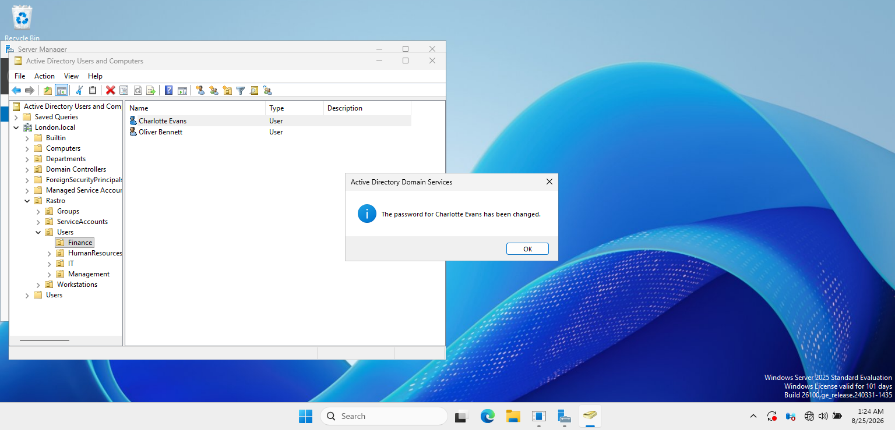
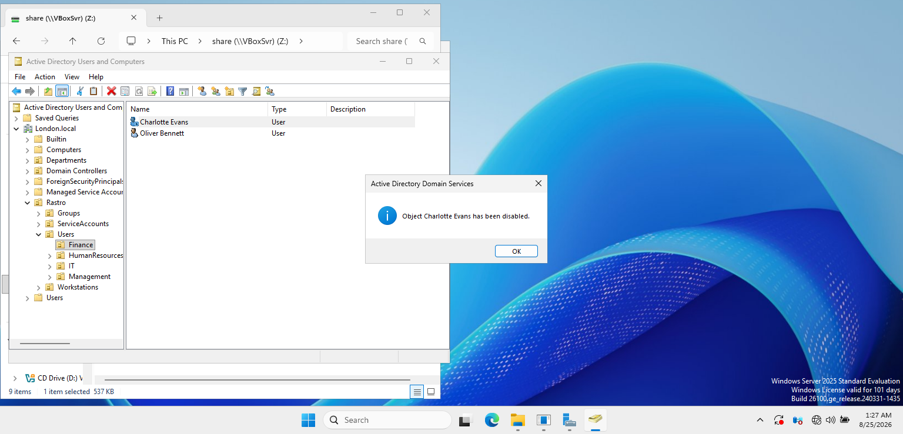
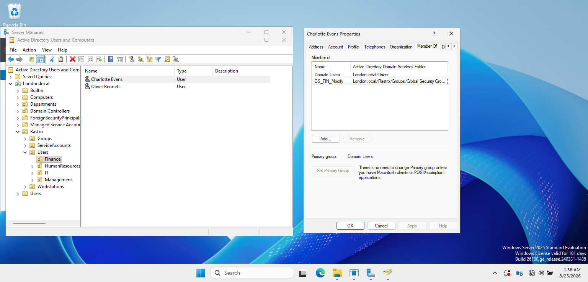
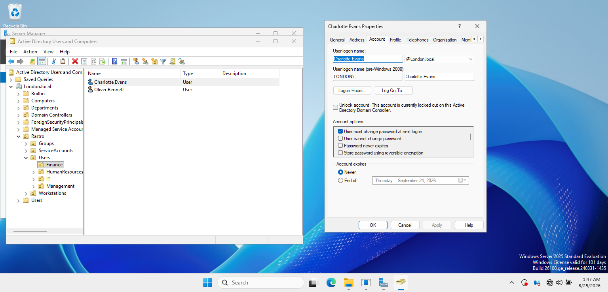

# Active Directory Administrative Tasks

## Overview

This lab demonstrates common day-to-day Active Directory administrative tasks performed in the `London.local` domain.

The tasks were completed using Active Directory Users and Computers (ADUC) on WSERVER1 and demonstrate practical user account and access management.

## Password Reset

A password reset was performed for an existing Finance department user.

The password was changed by the administrator without exposing credentials in the documentation.

## User Account Disable

The user account was disabled through Active Directory Users and Computers.

Disabling an account prevents authentication while preserving the user object, group memberships, and other account configuration.

## Security Group Membership Change

The Finance user's access level was changed through security group membership.

The user was assigned to:

`GS_FIN_Modify`

This demonstrates group-based access administration rather than assigning permissions directly to individual user accounts.

## Account Unlock

A locked user account was identified through the Account properties in Active Directory Users and Computers.

The account was then manually unlocked by the administrator, restoring the user's ability to authenticate.

## Skills Demonstrated

- Active Directory Users and Computers (ADUC)
- User password administration
- Account disable and enable operations
- Account lockout troubleshooting
- Account unlocking
- Security group membership management
- Group-based access administration
- Day-to-day Active Directory user support

## Outcome

Common Active Directory user administration tasks were successfully completed and validated in the `London.local` domain.

The lab demonstrates practical experience managing user account lifecycle, authentication issues, and security group membership in a Windows Server environment.
