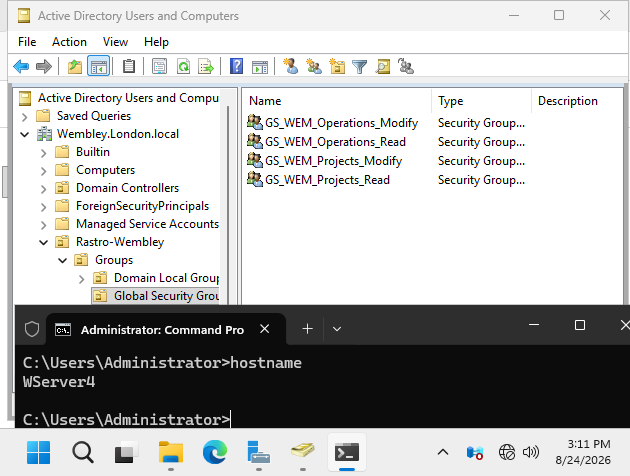
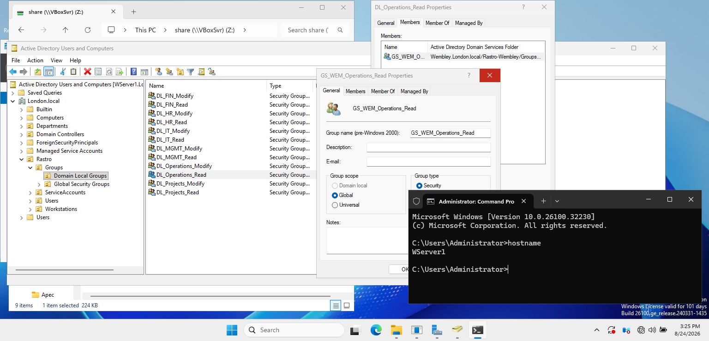
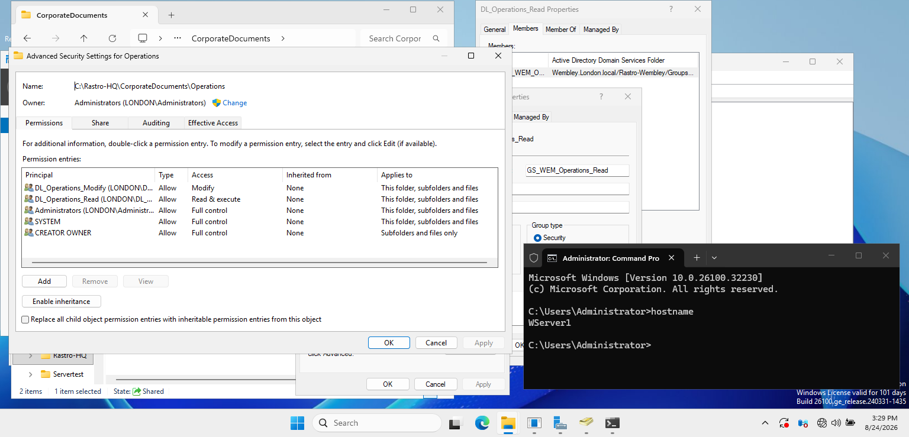
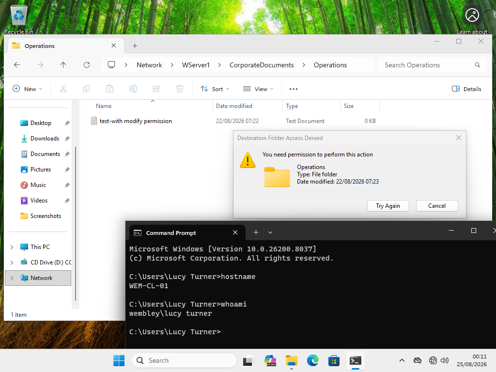
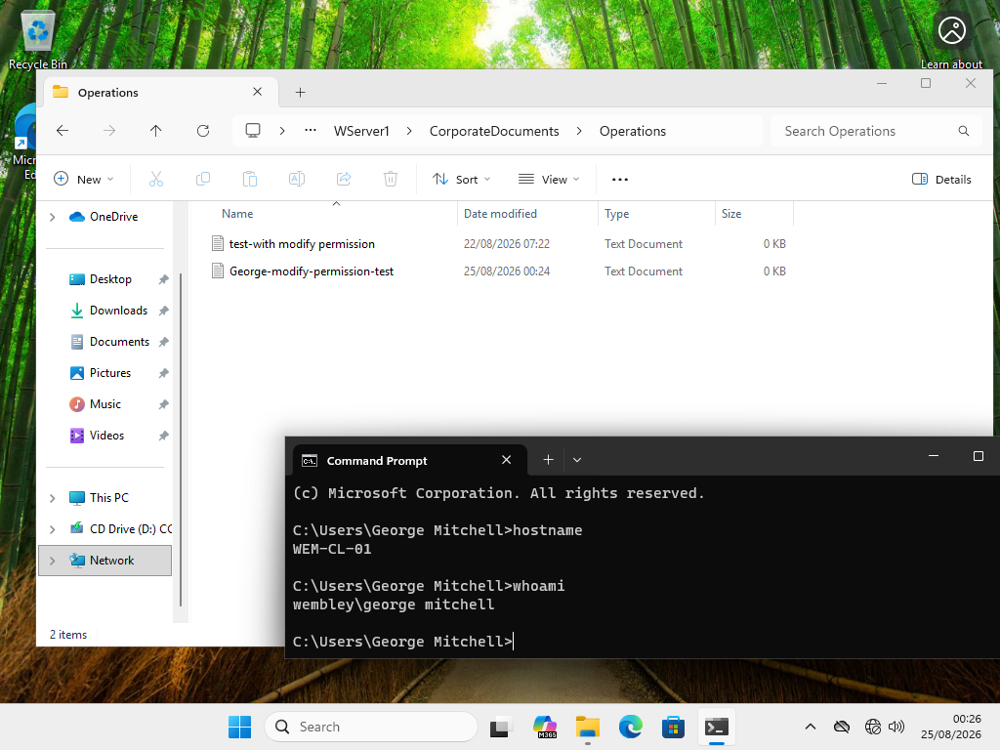
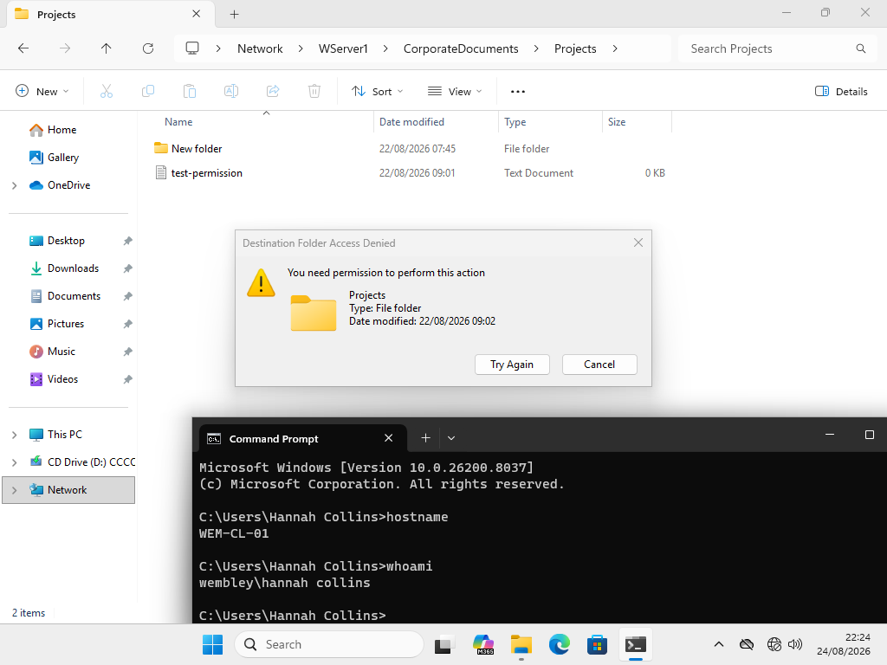
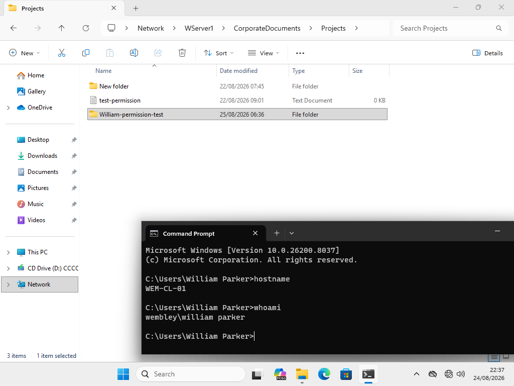

# Cross-Domain Access Control

## Overview

This lab demonstrates cross-domain resource access between a parent domain and a child domain in a Windows Server Active Directory environment.

Users located in the `Wembley.London.local` child domain were granted controlled access to resources hosted in the `London.local` parent domain.

The objective was to implement role-based access using Active Directory security groups rather than assigning permissions directly to individual users.

## Environment

| System | Domain | Role |
|---|---|---|
| WSERVER1 | London.local | Parent Domain Controller / File Server |
| WSERVER4 | Wembley.London.local | Child Domain Controller |
| WEM-CL-01 | Wembley.London.local | Windows 11 Test Client |

The protected resources are hosted on WSERVER1:

- `CorporateDocuments\Operations`
- `CorporateDocuments\Projects`

---

## Security Group Design

Global Security Groups were created in the Wembley child domain to represent the required access levels.

### Wembley Global Security Groups

- `GS_WEM_Operations_Read`
- `GS_WEM_Operations_Modify`
- `GS_WEM_Projects_Read`
- `GS_WEM_Projects_Modify`

Domain Local Security Groups were used in the London parent domain to control access to the resources hosted on WSERVER1.

The design follows the principle:

`User → Global Group → Domain Local Group → Permission`

This avoids assigning NTFS permissions directly to individual user accounts and makes access easier to manage.

---

## Cross-Domain Group Nesting

The Wembley Global Security Groups were added to the corresponding Domain Local Security Groups in the London domain.

Example:

`WEMBLEY User`
→ `GS_WEM_Operations_Read`
→ `DL_Operations_Read`
→ `Operations folder`

This allows users from the child domain to receive permissions to resources located in the parent domain.

---

## NTFS Permissions

Permissions were assigned to the Domain Local groups on WSERVER1.

For the Operations folder:

| Security Group | Permission |
|---|---|
| DL_Operations_Read | Read & Execute |
| DL_Operations_Modify | Modify |

Permissions apply to:

`This folder, subfolders and files`

This design keeps resource permissions on the domain where the resource is hosted while allowing users from another trusted domain to receive access through group membership.

---

## Access Validation

Access was tested from the Windows 11 client `WEM-CL-01`, which is joined to the `Wembley.London.local` domain.

The `hostname` and `whoami` commands were used during testing to verify both the client computer and the logged-in domain user.

### Operations – Read Access

Lucy Turner was used to test read-only access to the Operations folder.

Access path:

`WEMBLEY\Lucy Turner`
→ `GS_WEM_Operations_Read`
→ `DL_Operations_Read`
→ `Operations`

Results:

- Operations folder accessible: **PASS**
- Existing content readable: **PASS**
- Create new folder/file: **DENIED**

The failed creation attempt confirms that the Read permission does not allow modification of the resource.

---

### Operations – Modify Access

George Mitchell was used to validate Modify access.

Access path:

`WEMBLEY\George Mitchell`
→ `GS_WEM_Operations_Modify`
→ `DL_Operations_Modify`
→ `Operations`

Results:

- Operations folder accessible: **PASS**
- Existing content accessible: **PASS**
- Create new folder/file: **PASS**

A test folder was successfully created on WSERVER1 from the Wembley client.

---

### Projects – Read Access

Hannah Collins was used to validate read-only access to the Projects folder.

Access path:

`WEMBLEY\Hannah Collins`
→ `GS_WEM_Projects_Read`
→ `DL_Projects_Read`
→ `Projects`

Results:

- Projects folder accessible: **PASS**
- Existing content readable: **PASS**
- Create new folder/file: **DENIED**

The denied creation attempt confirms that the Read permission is working as intended.

---

### Projects – Modify Access

William Parker was used to validate Modify access.

Access path:

`WEMBLEY\William Parker`
→ `GS_WEM_Projects_Modify`
→ `DL_Projects_Modify`
→ `Projects`

Results:

- Projects folder accessible: **PASS**
- Existing content accessible: **PASS**
- Create new folder/file: **PASS**

A test folder was successfully created from the Wembley client.

---

## Test Results

| Test User | Domain | Resource | Expected Access | Result |
|---|---|---|---|---|
| Lucy Turner | Wembley | Operations | Read | PASS |
| George Mitchell | Wembley | Operations | Modify | PASS |
| Hannah Collins | Wembley | Projects | Read | PASS |
| William Parker | Wembley | Projects | Modify | PASS |

All four cross-domain access scenarios behaved according to the configured permissions.

---

## Skills Demonstrated

This lab demonstrates practical experience with:

- Active Directory parent and child domains
- Cross-domain resource access
- Global Security Groups
- Domain Local Security Groups
- Security group nesting
- NTFS permissions
- Role-based access control
- Principle of least privilege
- Windows file server access
- Windows 11 domain clients
- Permission validation and troubleshooting

## Outcome

Cross-domain access was successfully implemented between `Wembley.London.local` and `London.local`.

Users from the Wembley child domain were able to access resources hosted in the London parent domain according to their assigned roles.

Read-only users could access existing content but were prevented from creating or modifying files, while users assigned Modify permissions were able to create content successfully.

The final configuration demonstrates a scalable group-based approach to managing access across Active Directory domains.
