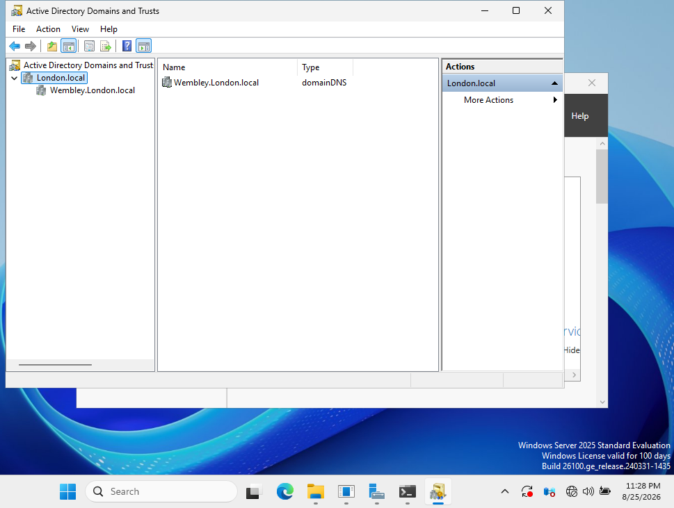
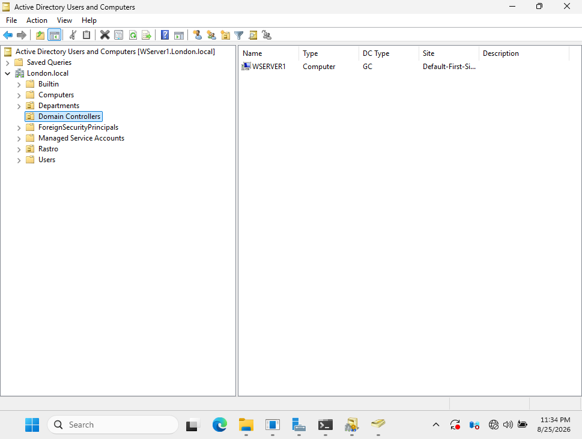
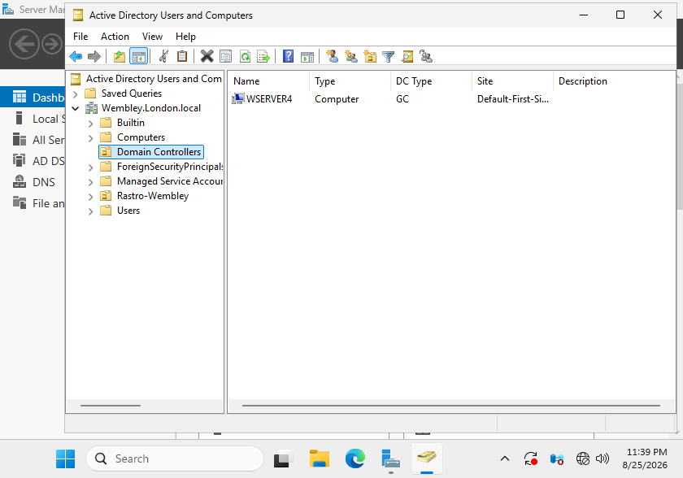

# Active Directory Domain Architecture

## Overview

This section demonstrates the Active Directory domain architecture used in the Windows Server homelab.

The environment was designed using a parent and child domain structure, with separate Domain Controllers for each domain.

## Domain Structure

The Active Directory forest uses `London.local` as the forest root domain with `Wembley.London.local` configured as a child domain.

```text
London.local
│
├── WSERVER1
│   └── Parent Domain Controller
│
└── Wembley.London.local
    └── WSERVER4
        └── Child Domain Controller
```

The domain hierarchy can be viewed through Active Directory Domains and Trusts.



## Parent Domain Controller

`WSERVER1` operates as the Domain Controller for the `London.local` parent domain.

The server is also configured as a Global Catalog server.



## Child Domain Controller

`WSERVER4` operates as the Domain Controller for the `Wembley.London.local` child domain.

The server is also configured as a Global Catalog server.



## Architecture Summary

| Server | Domain | Role |
|---|---|---|
| WSERVER1 | London.local | Parent Domain Controller / Global Catalog |
| WSERVER4 | Wembley.London.local | Child Domain Controller / Global Catalog |

## Skills Demonstrated

- Active Directory Domain Services
- Active Directory forest architecture
- Parent and child domain configuration
- Domain Controller deployment
- Global Catalog configuration
- Multi-domain Active Directory administration
- Active Directory Domains and Trusts

## Outcome

A functional multi-domain Active Directory environment was implemented using a parent and child domain architecture.

The configuration provides separate domain administration while maintaining both domains within the same Active Directory forest.
