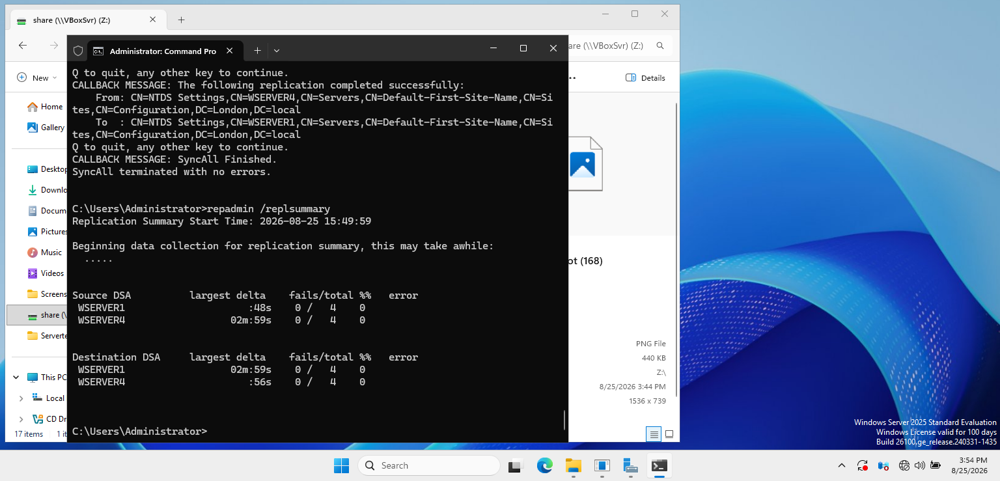
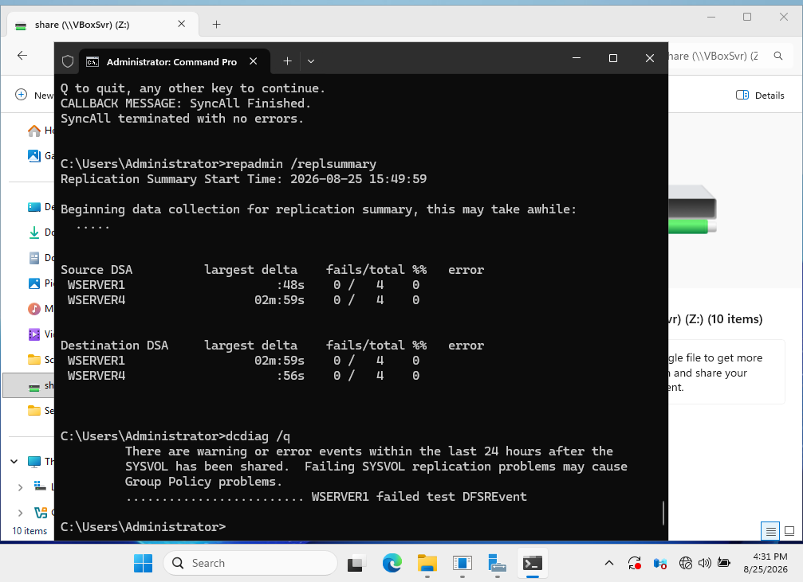
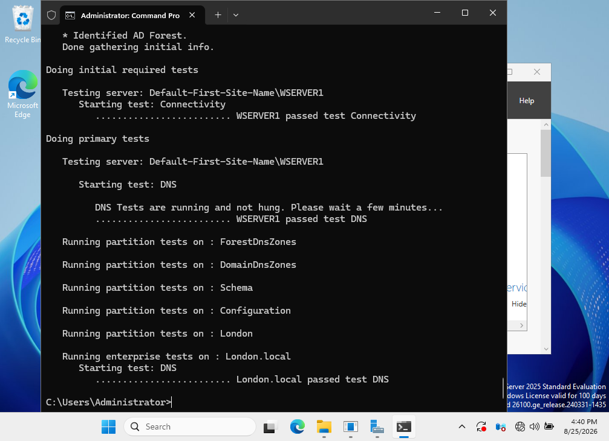
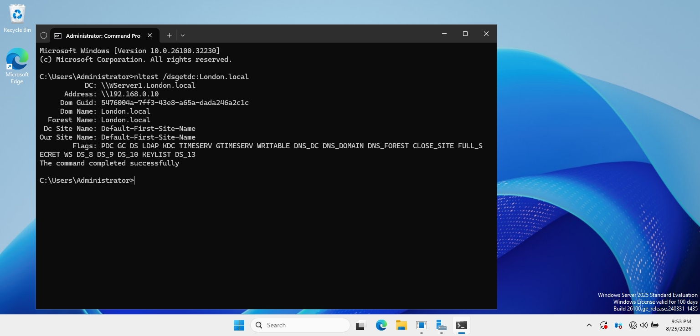
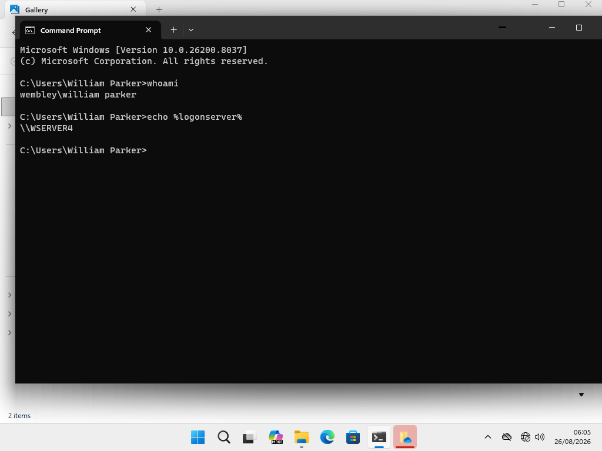

# Active Directory Testing & Troubleshooting

## Overview

This section demonstrates diagnostic and troubleshooting tasks performed in the multi-domain Active Directory environment.

The tests were used to verify Active Directory replication, DNS functionality, Domain Controller discovery, and client authentication.

## Active Directory Replication

During testing, replication errors were detected while WSERVER4 was offline.

After WSERVER4 was brought back online, Active Directory replication was manually synchronized and verified using:

```cmd
repadmin /syncall /AdeP
repadmin /replsummary
```

The final replication summary reported **0 failures** for both WSERVER1 and WSERVER4.



## DCDiag Verification

`dcdiag` was used to check the health of the Domain Controller.

```cmd
dcdiag /q
```

The test reported a DFS Replication event from the previous 24 hours, while the current Active Directory replication status showed no failures.



## DNS Health Check

DNS functionality was verified using:

```cmd
dcdiag /test:dns
```

WSERVER1 successfully passed both the connectivity and DNS tests, and the `London.local` domain passed the DNS validation.



## Domain Controller Discovery

Domain Controller discovery was tested using:

```cmd
nltest /dsgetdc:London.local
```

The command successfully located WSERVER1 and returned the expected domain, forest, site, DNS, LDAP, Kerberos, and Global Catalog information.



## Client Domain Authentication

Authentication was verified from the Wembley domain Windows client using:

```cmd
whoami
echo %logonserver%
```

The client confirmed that a `Wembley` domain user was logged in and that authentication was provided by WSERVER4.



## Skills Demonstrated

- Active Directory troubleshooting
- Domain Controller health testing
- AD replication diagnostics
- Manual replication synchronization
- DNS health verification
- Domain Controller discovery
- Domain authentication verification
- `dcdiag`, `repadmin`, and `nltest`
- Windows command-line troubleshooting

## Outcome

Active Directory replication, DNS services, Domain Controller discovery, and client authentication were successfully verified across the lab environment.

The troubleshooting process also demonstrated how an offline Domain Controller can temporarily generate replication and diagnostic errors and how the environment can be validated after connectivity is restored.
