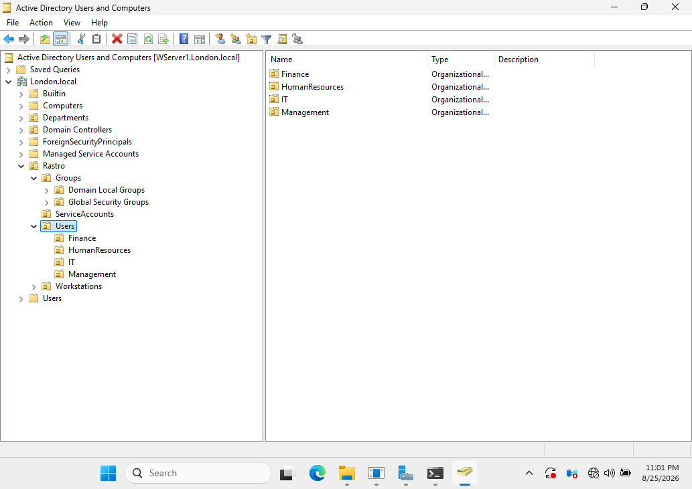
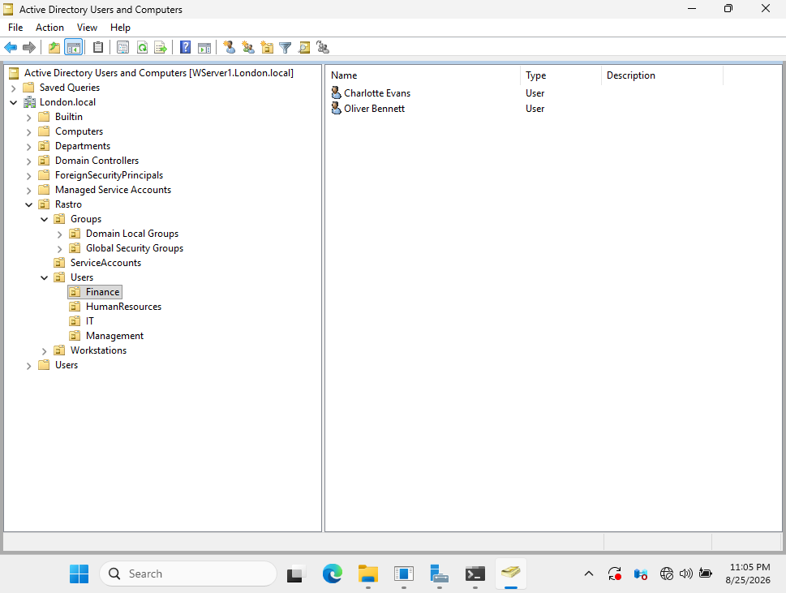
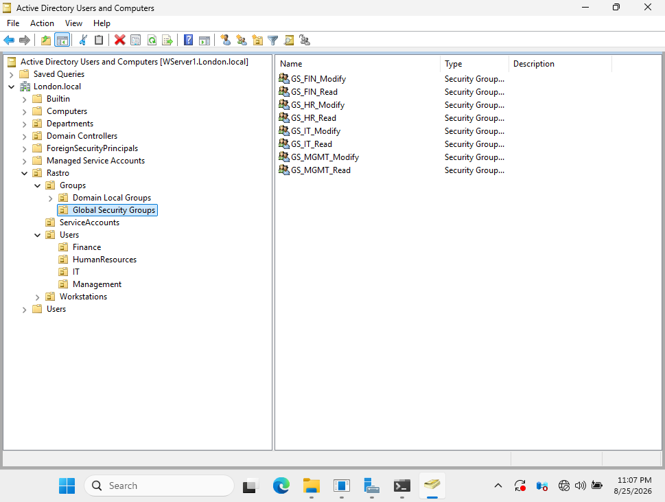
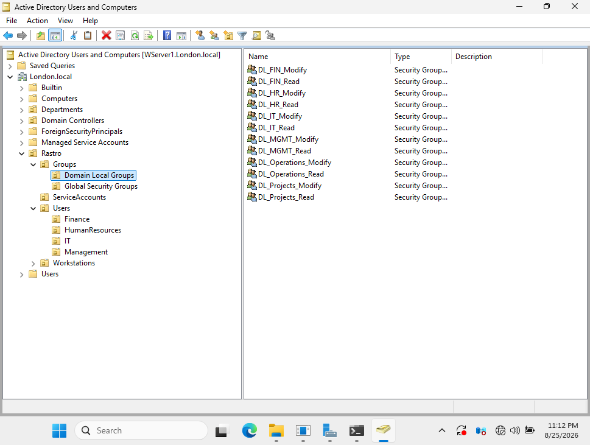
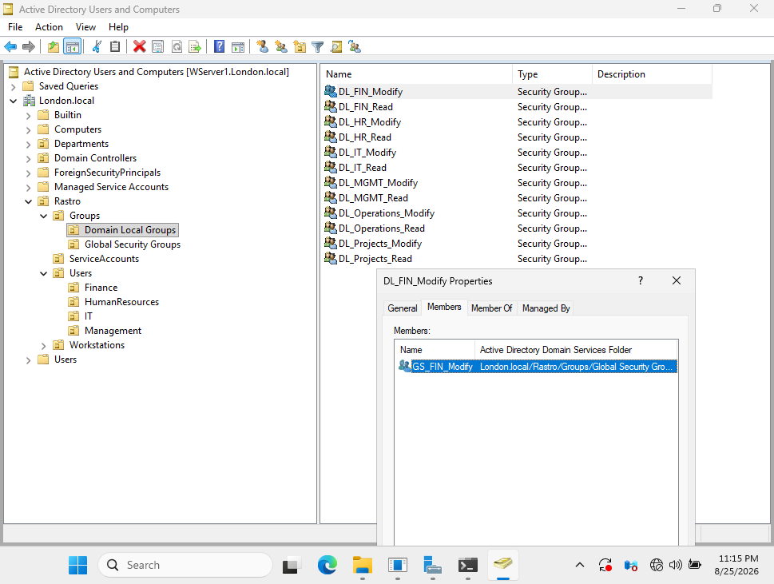

# Active Directory Users, Groups and OUs

## Overview

This section demonstrates the organization and management of users, Organizational Units (OUs), and security groups within the `London.local` domain.

The structure was designed to separate users and resources by department and to provide group-based access management.

## Organizational Unit Structure

A structured OU hierarchy was created under the `Rastro` OU to organize users, groups, service accounts, and workstations.

Department-specific OUs were created for:

- Finance
- Human Resources
- IT
- Management



## Department Users

User accounts were organized into department-specific OUs rather than using the default Users container.

The Finance OU, for example, contains user accounts belonging to the Finance department.



## Global Security Groups

Global Security Groups were created to organize users according to department and required access level.

Separate groups were created for **Read** and **Modify** access.

Examples:

- `GS_FIN_Read`
- `GS_FIN_Modify`
- `GS_HR_Read`
- `GS_HR_Modify`
- `GS_IT_Read`
- `GS_IT_Modify`
- `GS_MGMT_Read`
- `GS_MGMT_Modify`



## Domain Local Groups

Domain Local Groups were created to represent access permissions to resources.

Read and Modify groups were created for departmental and shared resources.



## Group Nesting

Group nesting was used to separate user membership from resource permissions.

For example:

```text
User
  ↓
GS_FIN_Modify
  ↓
DL_FIN_Modify
  ↓
Resource Permission
```

The `GS_FIN_Modify` Global Security Group is nested inside the `DL_FIN_Modify` Domain Local Group.



This structure follows the principles of the **AGDLP** access model:

```text
Accounts
   ↓
Global Groups
   ↓
Domain Local Groups
   ↓
Permissions
```

This makes access management easier to maintain and reduces the need to assign permissions directly to individual user accounts.

## Skills Demonstrated

- Active Directory Users and Computers (ADUC)
- Organizational Unit design
- Department-based user organization
- User account management
- Global Security Groups
- Domain Local Groups
- Security group nesting
- AGDLP permission model
- Role-based access management

## Outcome

A structured Active Directory environment was implemented using departmental OUs and group-based access management.

Users can be assigned to Global Security Groups based on their organizational role, while Domain Local Groups are used to control access to resources, providing a scalable and manageable permission structure.
