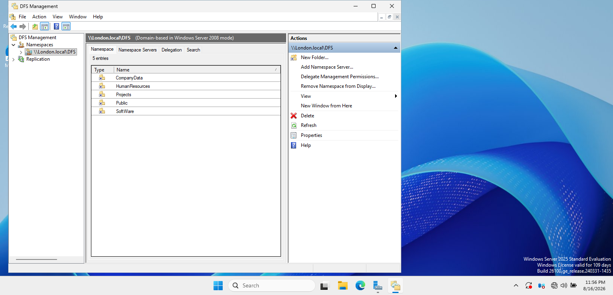
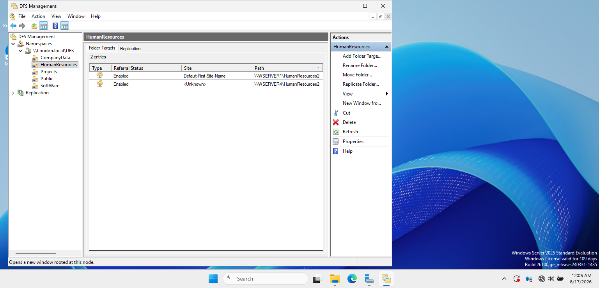
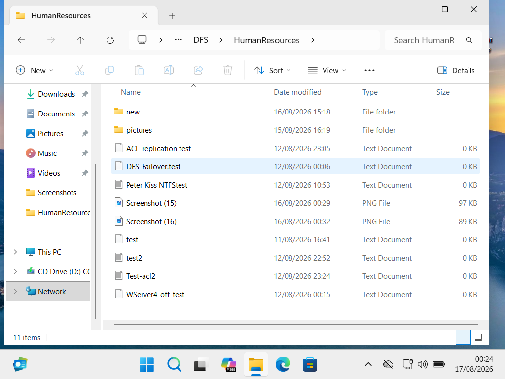

# DFS Namespace

## Objective

The objective of this part of the project was to provide users with a centralized and consistent path for accessing shared company resources.

A domain-based DFS Namespace was implemented so users do not need to know the physical server location of shared folders.

## Configuration

The DFS Namespace was configured in the `London.local` domain.

**Namespace Path:**

```text
\\London.local\DFS
```

**Namespace Type:**

- Domain-based namespace
- Windows Server 2008 mode

**Namespace Server:**

- WSERVER1

  ### Namespace Structure

The domain-based DFS Namespace contains the company shared resources configured under `\\London.local\DFS`.



The namespace provides centralized access to company shared resources, including:

- CompanyData
- HumanResources
- Projects
- Public
- SoftWare

## Implementation

DFS Namespaces was installed and configured on WSERVER1.

Folder targets were added to the namespace so users could access shared resources through the domain-based DFS path rather than connecting directly to an individual file server.

For example:

```text
\\London.local\DFS\HumanResources
```

### Folder Targets

The HumanResources namespace folder is configured with folder targets on both WSERVER1 and WSERVER4.


## Testing and Verification

The namespace was tested from the domain-joined Windows 11 client.

The client successfully accessed the DFS namespace using:

```text
\\London.local\DFS
```

The configured namespace folders were visible and accessible from the client.

### Client-Side Access

The domain-joined Windows 11 HR client successfully accessed the HumanResources folder through the DFS Namespace.



## Result

The DFS Namespace successfully provided a centralized location for accessing company shared resources while hiding the underlying physical server paths from users.
