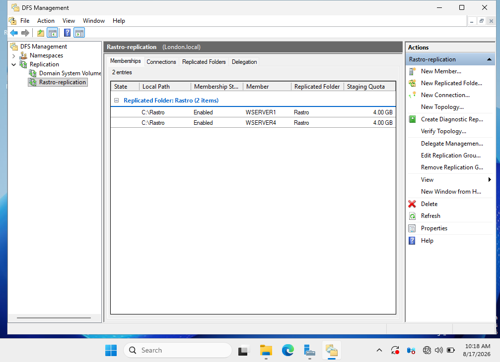
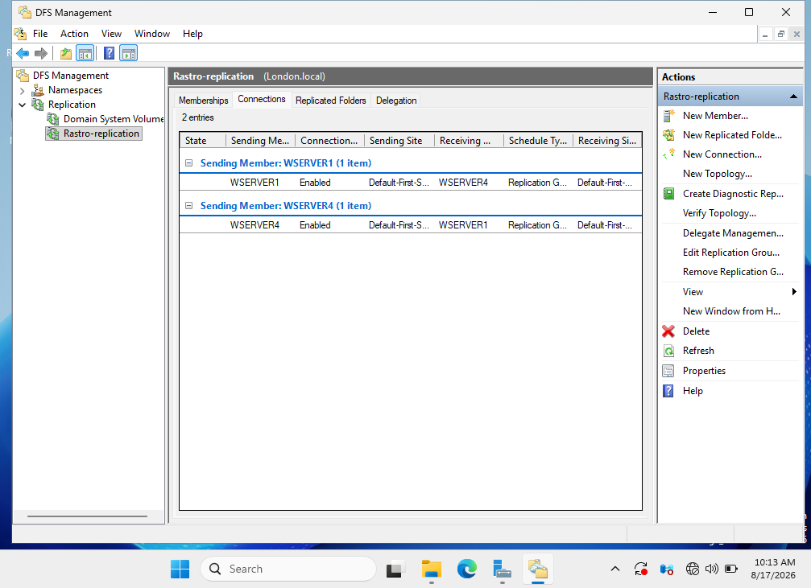
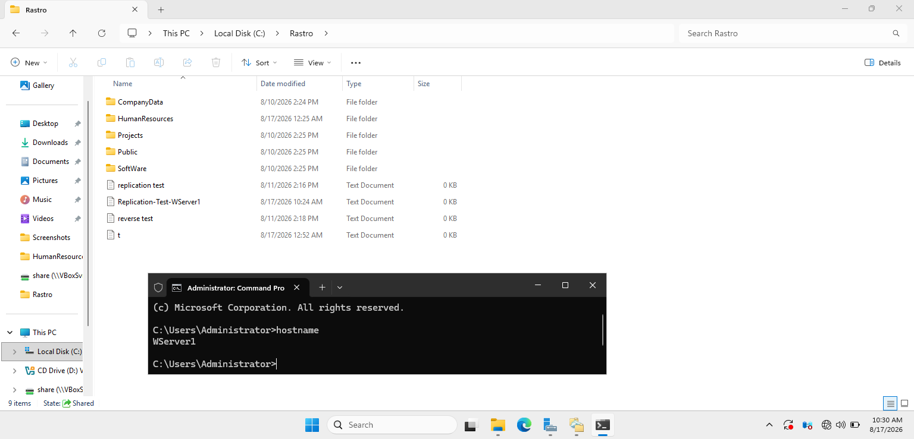
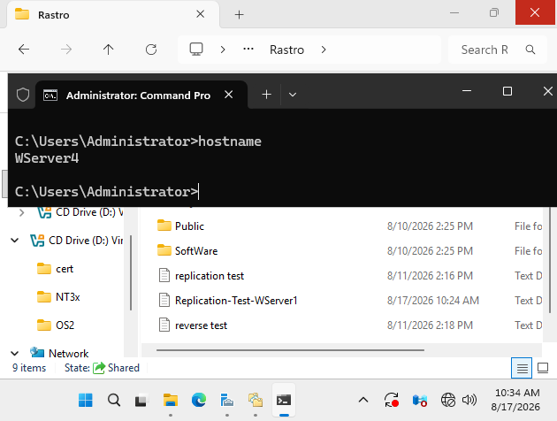
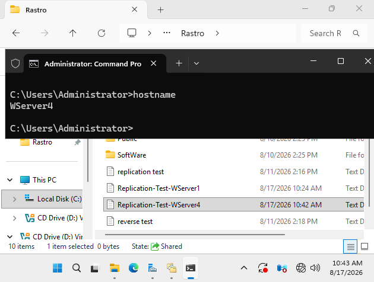
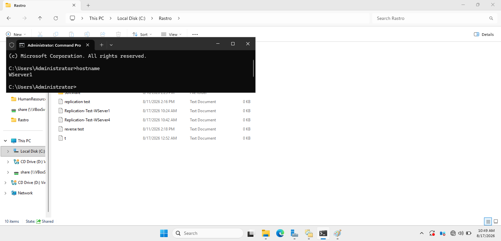
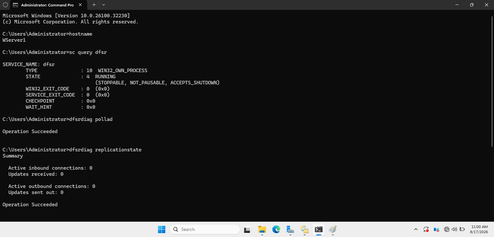

# DFS Replication

## Objective

The objective of this part of the project was to provide automatic file synchronization between two Windows Servers using Distributed File System Replication (DFSR).

The environment uses servers located in a parent and child Active Directory domain, demonstrating DFS Replication across a multi-domain infrastructure.

## Environment

| Server | Domain | Role |
|---|---|---|
| WSERVER1 | London.local | DFS Replication Member |
| WSERVER4 | Wembley.London.local | DFS Replication Member |

Replication was configured between:

```text
WSERVER1 ↔ WSERVER4
```

## Configuration

A DFS Replication Group was created with WSERVER1 and WSERVER4 as replication members.

The replication was configured as:

- **Replication direction:** Bidirectional
- **Members:** WSERVER1 and WSERVER4
- **Replication schedule:** Continuous
- **Bandwidth:** Full
- **Replication technology:** DFS Replication (DFSR)

This allows changes made to replicated data on either server to be synchronized with the other server.

### Replication Group Configuration

The `Rastro-replication` replication group contains WSERVER1 and WSERVER4 as enabled members of the replicated `Rastro` folder.



The connection configuration confirms enabled replication connections in both directions between WSERVER1 and WSERVER4.



## Implementation

DFS Replication was installed and configured on both Windows Servers.

The servers were added to the same replication group and configured to maintain synchronized copies of the replicated data.

The environment was designed so that changes could be made on either server and automatically replicated to the other DFS member.

## Testing and Verification

Replication was tested in both directions.

### WSERVER1 → WSERVER4

The test file was created in `C:\Rastro` on WSERVER1.



The same file successfully appeared in `C:\Rastro` on WSERVER4.



A test file was created on WSERVER1 and successfully appeared on WSERVER4.

### WSERVER4 → WSERVER1

A second test file was created in `C:\Rastro` on WSERVER4.



The file successfully appeared in `C:\Rastro` on WSERVER1.



A second test file was created on WSERVER4 and successfully replicated back to WSERVER1.

This confirmed that bidirectional replication was functioning correctly.

### DFSR Verification

DFS Replication was also verified using administrative commands including:

```cmd
sc query dfsr
dfsrdiag pollad
dfsrdiag replicationstate
```

The DFS Replication service was confirmed as running, and DFSR successfully polled Active Directory for its current configuration.



These commands were used to verify that the DFS Replication service was running, refresh Active Directory configuration information, and inspect the current replication state.

## Result

Bidirectional DFS Replication between WSERVER1 and WSERVER4 was successfully implemented and tested.

Changes to replicated data were automatically synchronized between the two servers, demonstrating multi-server file replication and redundancy using DFSR.
