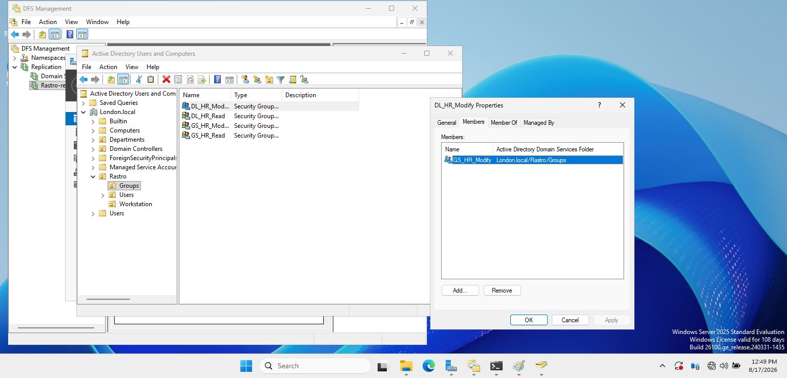
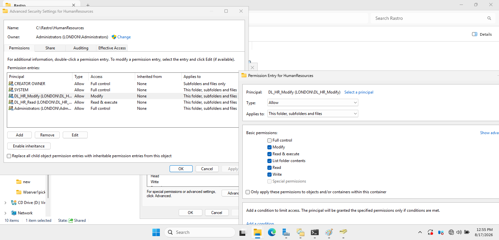
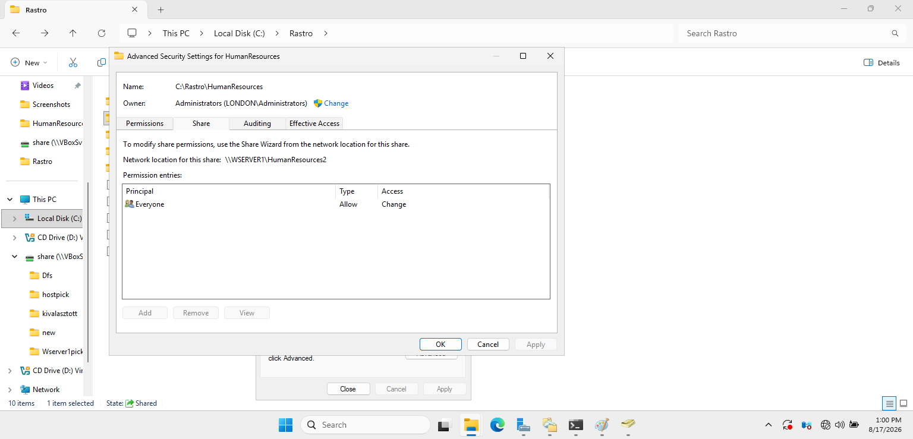
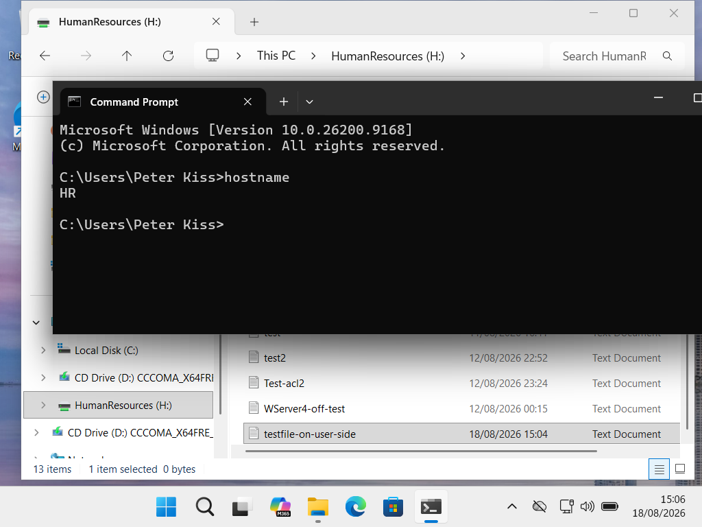

# DFS Permissions and Access Control

## Objective

The objective of this part of the project was to control access to DFS shared resources using Active Directory security groups, Share permissions, and NTFS permissions.

This demonstrates centralized access management rather than assigning permissions directly to individual users.

## Access Control Design

Active Directory security groups were used to manage access to the HumanResources folder.

The following security groups were configured:

- `GS_HR_Read`
- `GS_HR_Modify`
- `DL_HR_Read`
- `DL_HR_Modify`

The access model follows this structure:

`User → Global Security Group → Domain Local Group → Folder Permission`

For example, `GS_HR_Modify` is nested inside `DL_HR_Modify`, allowing permissions to be managed through group membership rather than assigning permissions directly to individual users.



## Share and NTFS Permissions

The HumanResources folder is located at:

```text
C:\Rastro\HumanResources
```

NTFS permissions were assigned to the Domain Local security groups:

| Security Group | NTFS Permission |
|---|---|
| `DL_HR_Read` | Read & Execute |
| `DL_HR_Modify` | Modify |

These permissions apply to the folder, subfolders, and files.



The SMB Share permission was configured as:

```text
Everyone → Change
```

Detailed access control is then enforced through the NTFS permissions and Active Directory security groups.



## DFS and Permissions

Users access the HumanResources resource through the DFS Namespace:

```text
\\London.local\DFS\HumanResources
```

The DFS Namespace provides the centralized access path, while the underlying Share and NTFS permissions determine what users are allowed to do with the files and folders.

## Testing and Verification

Access was tested using a domain user account on the Windows 11 client `HR`.

The HumanResources DFS resource was mapped as the `H:` drive. An authorized user with Modify access successfully created a test file inside the shared folder.



During testing, Share permissions were adjusted after identifying that NTFS Modify permission alone did not allow the expected file creation because the Share permission was more restrictive.

After correcting the Share permission, authorized users were able to create and modify files successfully.

## Result

The testing confirmed that Active Directory security groups, Share permissions, and NTFS permissions work together to provide controlled access to the HumanResources DFS resource.

The configuration demonstrates centralized, group-based access management in a Windows Server environment.
