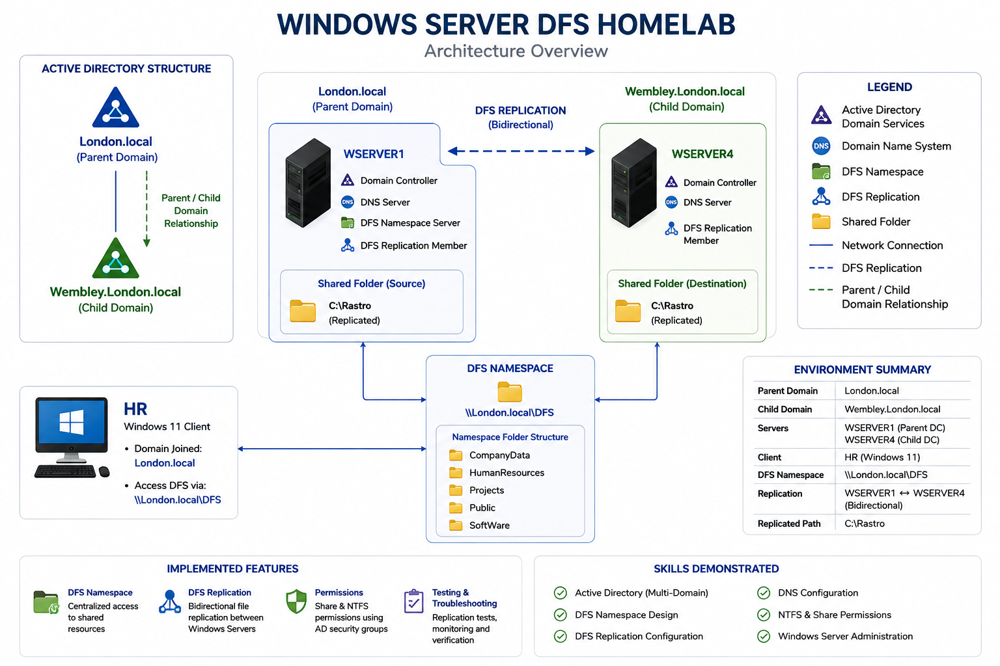

# Windows Server DFS Homelab

## Overview

This project demonstrates a Windows Server DFS environment built across a parent and child Active Directory domain.

The lab provides centralized access to company resources through DFS Namespace and bidirectional data replication between two Windows Servers using DFS Replication.

## Architecture

## Environment

| System | Role | Domain |
|---|---|---|
| WSERVER1 | Domain Controller, DNS, DFS Namespace, DFS Replication | London.local |
| WSERVER4 | Domain Controller, DFS Replication | Wembley.London.local |
| HR | Windows 11 Client | London.local |

**DFS Namespace:** `\\London.local\DFS`  
**Replication:** WSERVER1 ↔ WSERVER4

## Project Components

### [DFS Namespace](DFS-Namespace/README.md)
Domain-based namespace providing centralized access to shared company resources.

### [DFS Replication](DFS-Replication/README.md)
Bidirectional replication between WSERVER1 and WSERVER4.

### [Permissions](Permissions/README.md)
Share and NTFS permissions managed using Active Directory security groups.

### [Testing & Troubleshooting](Testing-Troubleshooting/README.md)
Replication testing, verification commands, and troubleshooting.

## Skills Demonstrated

- DFS Namespace and DFS Replication
- Windows Server Administration
- Active Directory parent/child domain environment
- NTFS and Share Permissions
- Active Directory Security Groups
- File Server Administration
- Replication Testing and Troubleshooting

