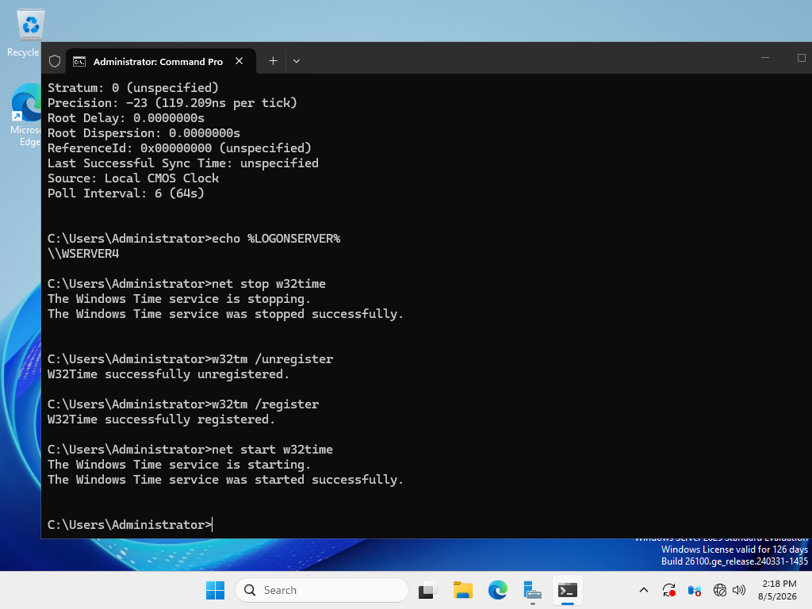
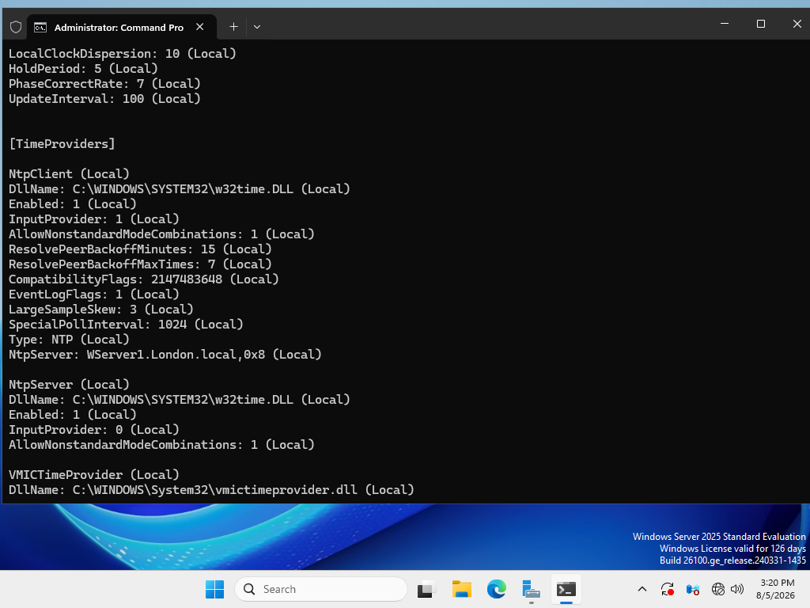
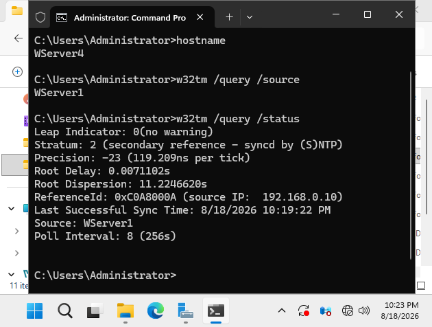
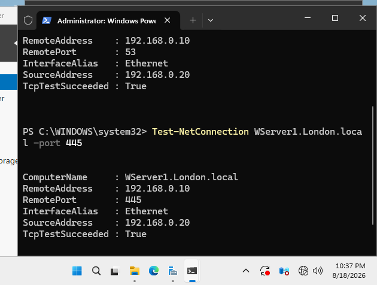

# DFS Testing and Troubleshooting

## Objective

The objective of this part of the project was to verify DFS Replication and troubleshoot issues affecting synchronization between WSERVER1 and WSERVER4.

Testing was performed across the multi-domain Windows Server environment and from the domain-joined Windows 11 client.

## Replication Testing

Bidirectional replication was tested by creating files on both DFS Replication members.

### WSERVER1 → WSERVER4

A test file was created on WSERVER1 and successfully appeared on WSERVER4.

### WSERVER4 → WSERVER1

A separate test file was created on WSERVER4 and successfully appeared on WSERVER1.

This confirmed that the `Rastro-replication` replication group was operating bidirectionally.

Detailed replication configuration and test evidence are documented in the DFS Replication section of the project.

## DFSR Service and Diagnostics

The DFS Replication service and configuration were verified using:

```cmd
sc query dfsr
dfsrdiag pollad
dfsrdiag replicationstate
```

`sc query dfsr` was used to verify that the DFS Replication service was running.

`dfsrdiag pollad` was used to force DFS Replication to poll Active Directory for updated configuration information.

`dfsrdiag replicationstate` was used to inspect current replication activity.

These checks helped verify that the DFSR service and Active Directory configuration were available during troubleshooting.

## Time Synchronization Troubleshooting

Time synchronization was one of the issues investigated during the lab.

WSERVER4 initially reported:

```text
Source: Local CMOS Clock
Last Successful Sync Time: unspecified
```

This indicated that the server was not synchronizing with the intended domain time source.



The Windows Time configuration was investigated and WSERVER4 was configured to use WSERVER1 as its NTP source.

The configuration showed:

```text
Type: NTP
NtpServer: WServer1.London.local,0x8
```



After configuration and troubleshooting, synchronization was verified again on WSERVER4.

The server successfully reported:

```text
Source: WServer1
Stratum: 2
```

A successful synchronization time and the WSERVER1 source address were also reported.



This confirmed that WSERVER4 was successfully using WSERVER1 as its time source.

## DNS and Network Connectivity Verification

Connectivity between WSERVER4 and WSERVER1 was verified using PowerShell.

The following services were tested:

- TCP 53 — DNS
- TCP 445 — SMB file sharing

Both tests returned:

```text
TcpTestSucceeded : True
```

WSERVER4 (`192.168.0.20`) successfully connected to WSERVER1 (`192.168.0.10`) on both required ports.



This helped confirm that DNS and SMB connectivity between the DFS Replication members was operational.

## Replication Recovery

During testing, DFS Replication did not always resume as expected after the virtual servers were restarted.

Troubleshooting included:

- Verifying the DFS Replication service
- Checking server connectivity
- Verifying DNS communication
- Checking time synchronization
- Polling Active Directory for updated DFSR configuration
- Testing replication with new files

After troubleshooting and rebuilding the replication configuration when required, bidirectional replication was successfully restored.

## Verification Commands

Commands used during testing and troubleshooting included:

```cmd
sc query dfsr
dfsrdiag pollad
dfsrdiag replicationstate
w32tm /query /source
w32tm /query /status
w32tm /resync
nslookup
ping
```

PowerShell was also used to verify connectivity to DNS and SMB services:

```powershell
Test-NetConnection WServer1.London.local -Port 53
Test-NetConnection WServer1.London.local -Port 445
```

## Result

DFS Replication was successfully tested in both directions between WSERVER1 and WSERVER4.

The troubleshooting process provided practical experience diagnosing DFS Replication, Active Directory communication, DNS and SMB connectivity, and Windows Time synchronization in a multi-domain Windows Server environment.


