# DHCP Server Deployment and Management

## Overview

This project demonstrates the deployment, configuration, security, testing, and administration of a Windows Server DHCP infrastructure in an Active Directory environment.

The DHCP Server role was configured on **WSERVER1** in the `London.local` domain. Because the server is multi-homed and one network interface is connected to the physical LAN through VirtualBox Bridged Networking, a separate isolated network was created specifically for DHCP testing.

The project covers:

- DHCP Server authorization in Active Directory
- DHCP interface binding on a multi-homed server
- IPv4 scope creation
- Address exclusions
- Lease configuration
- DHCP scope options
- Client lease verification
- DHCP reservations
- DHCP and DNS integration
- Secure Dynamic DNS updates
- Dedicated DNS update credentials
- Forward and reverse DNS registration
- DHCP Server backup
- PowerShell-based configuration verification

---

## Lab Environment

### Server

| Component | Configuration |
|---|---|
| Server | WSERVER1 |
| Operating System | Windows Server |
| Domain | London.local |
| AD/DNS Interface | 192.168.0.10 |
| DHCP LAB-NET Interface | 192.168.10.1 |
| DHCP Scope | 192.168.10.0/24 |
| DHCP Range | 192.168.10.100 – 192.168.10.200 |
| Exclusion Range | 192.168.10.100 – 192.168.10.109 |
| Lease Duration | 8 days |
| DNS Server | 192.168.0.10 |
| DNS Domain | London.local |

### Network Design

WSERVER1 is a multi-homed server.

The existing `192.168.0.0/24` network provides Active Directory and DNS connectivity. A separate VirtualBox Internal Network named `LAB-NET` was created for DHCP testing.

```text
                    WSERVER1
                       |
        +--------------+--------------+
        |                             |
   AD / DNS Network                LAB-NET
   192.168.0.10                   192.168.10.1
   Bridged Adapter                Internal Network
                                      |
                                      |
                                DHCP Clients
                                192.168.10.x
```

The DHCP service was intentionally prevented from binding to the Bridged `192.168.0.10` interface. This avoids the possibility of the lab DHCP server responding to DHCP requests on the physical LAN.

The isolated LAB-NET does not contain a router. Therefore, DHCP Option 003 (Router / Default Gateway) was intentionally not configured.

---

## 1. Active Directory DHCP Authorization

After installing the DHCP Server role, the post-install configuration wizard was used to authorize WSERVER1 in Active Directory.

Authorization was performed using the domain administrative account:

```text
LONDON\Administrator
```

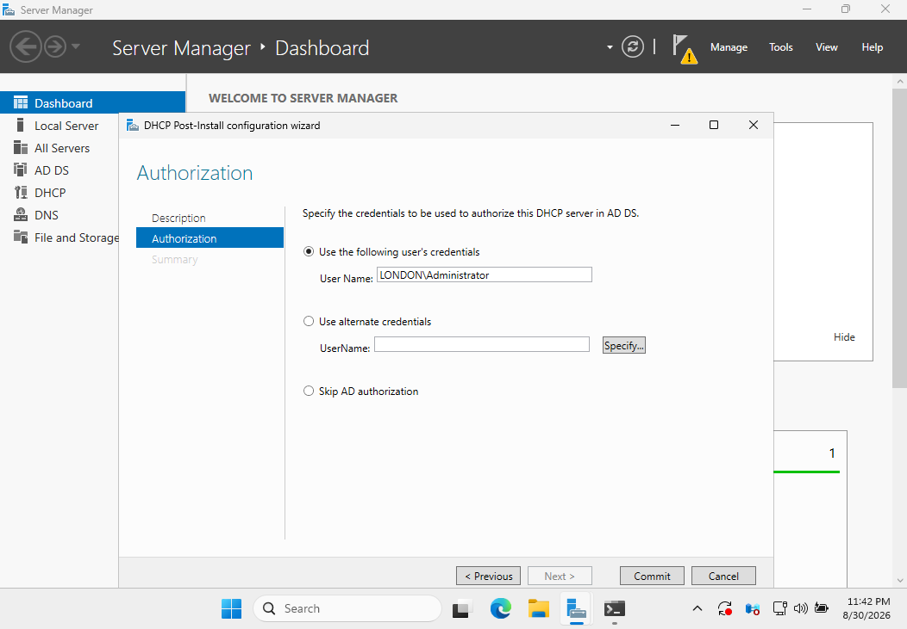

Active Directory authorization helps prevent unauthorized Windows DHCP servers from servicing domain networks.

The post-install configuration successfully:

- Created the required DHCP security groups
- Authorized the DHCP Server in Active Directory

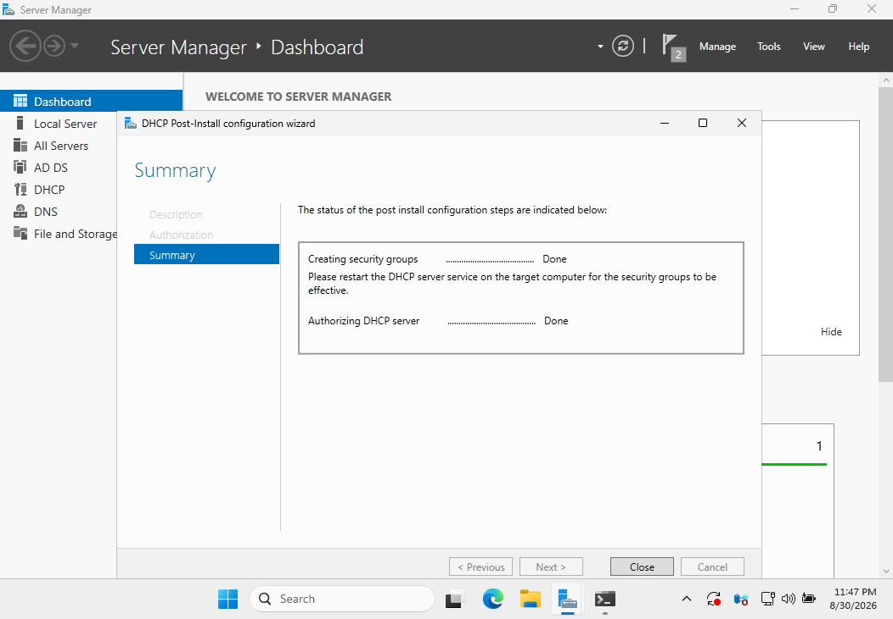

---

## 2. Securing DHCP Interface Binding

Because WSERVER1 has multiple network interfaces, it was important to control which interface the DHCP Server could use.

The current bindings were inspected with PowerShell:

```powershell
Get-DhcpServerv4Binding
```

Initially, DHCP was bound to both:

```text
192.168.10.1
192.168.0.10
```

The `192.168.0.10` interface uses VirtualBox Bridged Networking and connects to the existing physical network. Allowing the lab DHCP service to operate on this interface could cause it to compete with the legitimate DHCP service on the physical LAN.

The Bridged interface was therefore disabled for DHCP:

```powershell
Set-DhcpServerv4Binding -BindingState $false -InterfaceAlias "Ethernet"
```

The configuration was verified again:

```powershell
Get-DhcpServerv4Binding
```

Final state:

```text
Ethernet 3   192.168.10.1   True
Ethernet     192.168.0.10   False
```

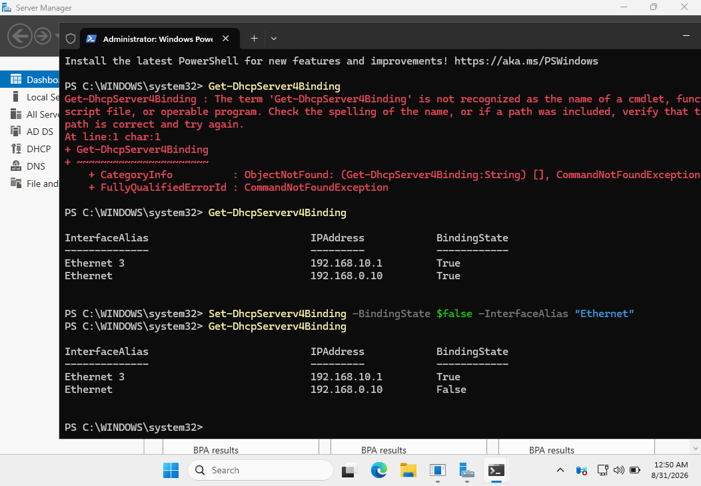

This configuration restricts DHCP service to the isolated LAB-NET.

### Troubleshooting Note

During the initial PowerShell verification, a cmdlet was entered incorrectly and returned a `CommandNotFoundException`.

The command was corrected and successfully executed. This provided a useful example of validating PowerShell syntax and confirming the resulting configuration rather than assuming a change was successful.

---

## 3. Creating the DHCP Scope

A new IPv4 scope was created:

```text
Scope Name: LAB-NET DHCP Scope
Network: 192.168.10.0/24

Start Address: 192.168.10.100
End Address:   192.168.10.200
Subnet Mask:   255.255.255.0

Lease Duration: 8 days
```

### Address Exclusion

The following addresses were excluded:

```text
192.168.10.100 – 192.168.10.109
```

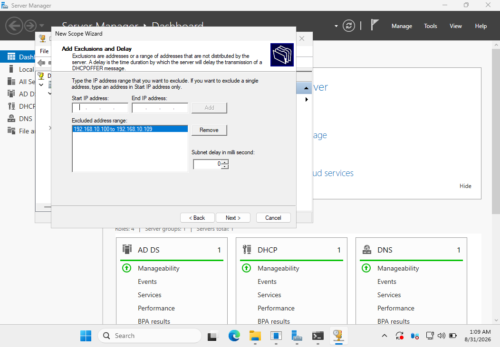

This means that although the configured scope begins at `.100`, DHCP will not dynamically assign the first ten addresses.

The effective initial dynamic allocation therefore begins at:

```text
192.168.10.110
```

The completed Address Pool confirms both the distribution range and exclusion range.

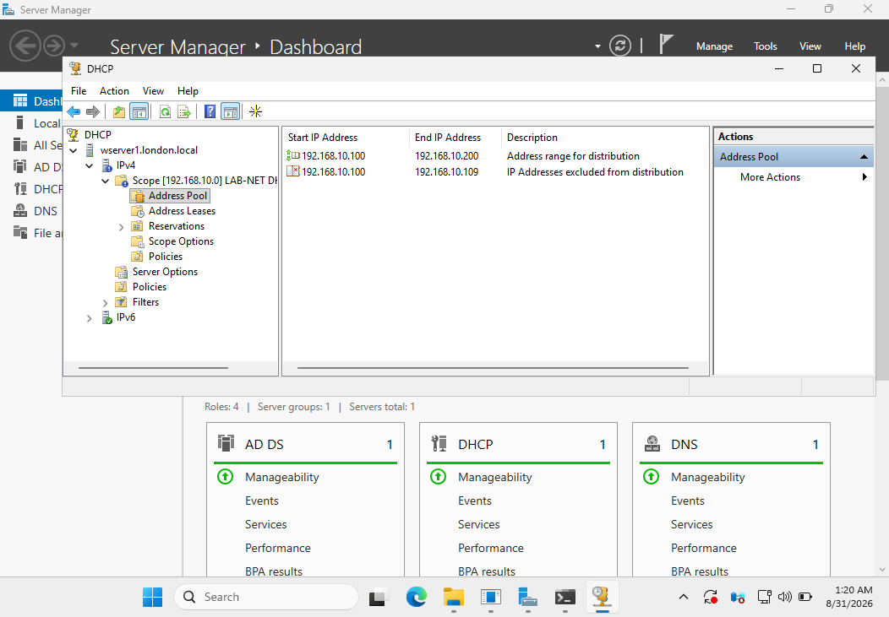

---

## 4. DHCP Scope Options

The following scope options were configured:

```text
006 DNS Servers       → 192.168.0.10
015 DNS Domain Name   → London.local
```

Option 006 tells DHCP clients which DNS server they should use.

Option 015 provides the DNS domain suffix.

### No Default Gateway

Option 003 (Router) was intentionally omitted.

The LAB-NET is an isolated VirtualBox Internal Network and WSERVER1 is not configured as a router between `192.168.10.0/24` and other networks.

Providing `192.168.10.1` as a default gateway would therefore have been misleading because WSERVER1 is acting as the DHCP server on that interface, not as a configured router.

---

## 5. Client DHCP Lease Verification

A Windows client was configured to obtain its LAB-NET IPv4 configuration automatically.

The client successfully received:

```text
IPv4 Address:  192.168.10.110
Subnet Mask:   255.255.255.0
DHCP Server:   192.168.10.1
DNS Server:    192.168.0.10
DNS Suffix:    London.local
```

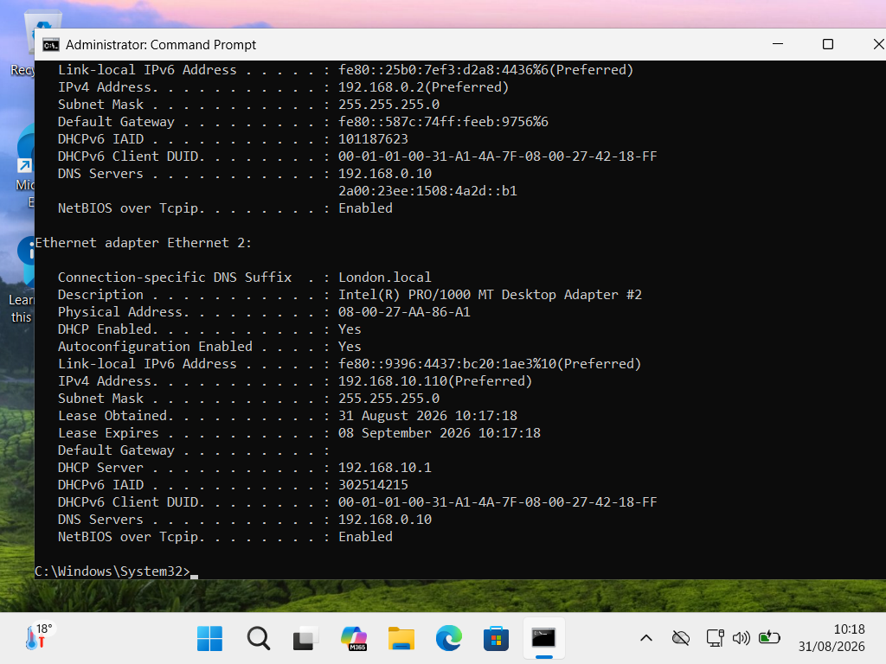

The first assigned address was `192.168.10.110`, confirming that the exclusion range `.100–.109` was being respected.

The default gateway remained empty as expected for this isolated lab network.

---

## 6. Server-Side Lease Verification

The DHCP console was used to verify the client lease from the server side.

The server displayed:

```text
Client IP: 192.168.10.110
Client Name: HR.London.local
Type: DHCP
```

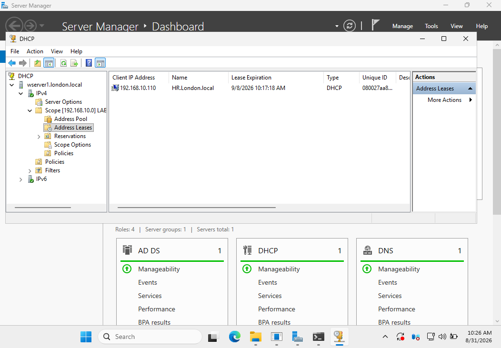

This confirms that the DHCP Discover/Offer/Request/Acknowledge process completed successfully and that WSERVER1 recorded the active lease.

---

## 7. DHCP Reservation

The client lease was converted into a DHCP reservation.

The reservation associates the client's MAC address with:

```text
192.168.10.110
```

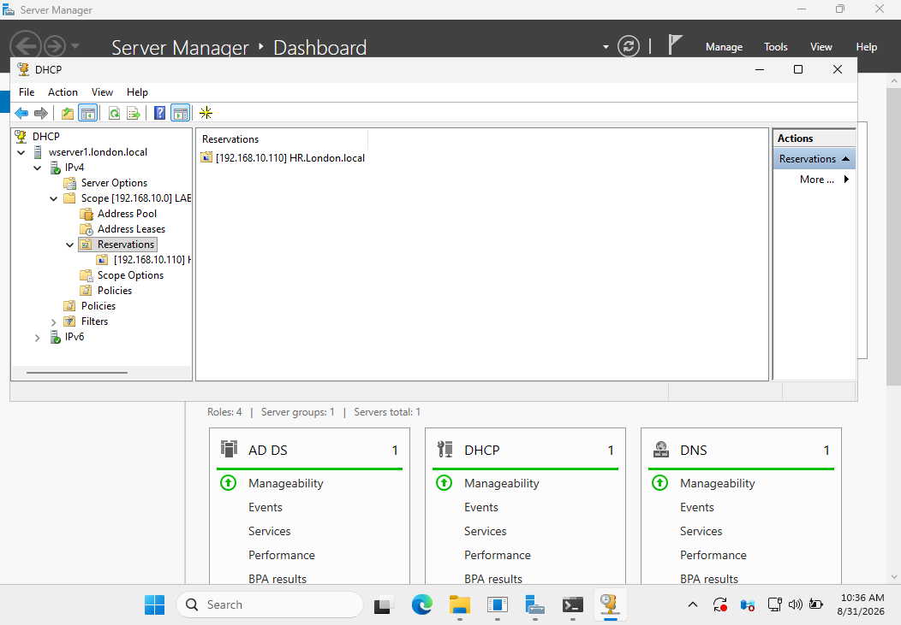

Unlike manually configuring a static IPv4 address on the client, the client remains configured to obtain its address automatically through DHCP.

The DHCP server ensures that the reserved client receives the same IPv4 address.

This provides centralized address management while maintaining predictable addressing for devices that require a consistent IP address.

---

## 8. DHCP and DNS Dynamic Updates

The DHCP scope was configured to perform Dynamic DNS updates.

The following settings were enabled:

- Enable DNS dynamic updates
- Always dynamically update DNS records
- Discard A and PTR records when a lease is deleted
- PTR updates enabled

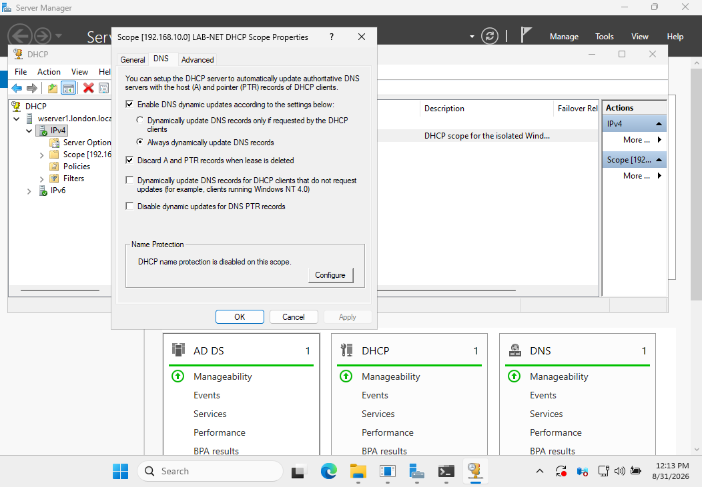

This allows DHCP to coordinate client address allocation with DNS registration.

---

## 9. Dedicated DHCP DNS Credentials

The `London.local` DNS zone uses secure dynamic updates.

Instead of relying on an administrative account for DHCP DNS operations, a dedicated Active Directory service account was created:

```text
LONDON\svc_DHCP_DNS
```

The existing DHCP DNS credential configuration was checked using:

```powershell
Get-DhcpServerDnsCredential
```

The credentials were securely collected in PowerShell:

```powershell
$Credential = Get-Credential
```

They were then assigned to the DHCP Server:

```powershell
Set-DhcpServerDnsCredential `
    -Credential $Credential `
    -ComputerName "WServer1.London.local"
```

The result was verified:

```powershell
Get-DhcpServerDnsCredential
```

The DHCP Server reported:

```text
UserName       DomainName
--------       ----------
svc_DHCP_DNS   LONDON
```

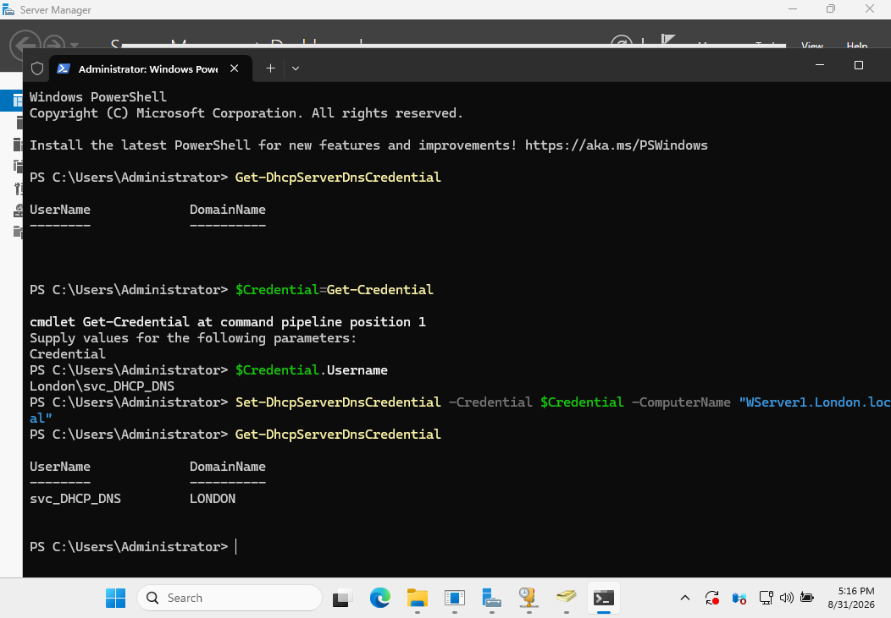

The password is not displayed or stored in the project documentation.

Using a dedicated account separates DHCP DNS operations from interactive administrative accounts and provides clearer service-account responsibility.

---

## 10. DHCP–DNS Integration Testing

A separate Windows test client named `HR-2` was created for clean DHCP and DNS integration testing.

The client used a single network adapter connected to:

```text
VirtualBox Internal Network: LAB-NET
```

It received:

```text
Hostname:       HR-2
IPv4 Address:   192.168.10.111
DHCP Server:    192.168.10.1
DNS Suffix:     London.local
```

The DHCP lease state was verified using PowerShell:

```powershell
Get-DhcpServerv4Lease -ScopeId 192.168.10.0 |
Format-Table IPAddress,HostName,AddressState,DnsRegistration,DnsRR -AutoSize
```

The new client reported:

```text
192.168.10.111
HR-2.London.local
DnsRegistration: Complete
DnsRR: AandPTR
```

This confirmed that DHCP successfully completed DNS registration for both forward and reverse records.

---

## 11. Reverse DNS and PTR Registration

A reverse lookup zone was created for the LAB-NET:

```text
10.168.192.in-addr.arpa
```

This corresponds to:

```text
192.168.10.0/24
```

After the HR-2 client obtained its DHCP lease, DNS contained the dynamically registered PTR record:

```text
192.168.10.111 → HR-2.London.local
```

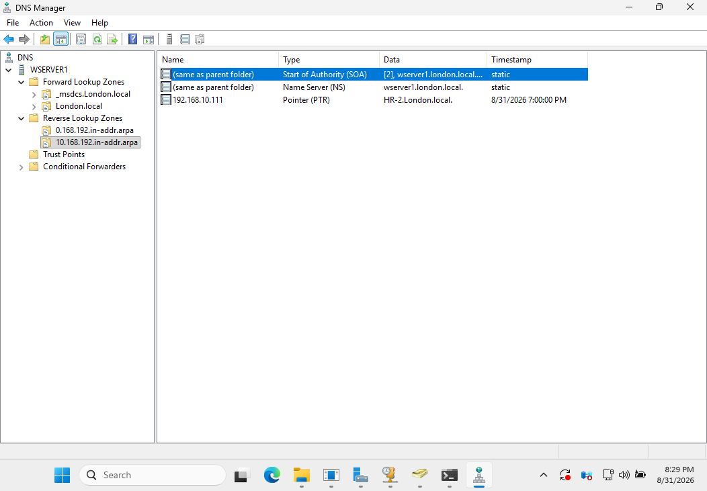

The timestamp on the PTR record demonstrates that it was dynamically registered rather than created as a static manual record.

Together with the corresponding A record, this demonstrates successful DHCP and DNS integration:

```text
Forward Lookup

HR-2.London.local
        |
        v
192.168.10.111


Reverse Lookup

192.168.10.111
        |
        v
HR-2.London.local
```

---

## 12. DHCP Server Backup

A DHCP Server backup was created to:

```text
C:\DHCP-Backup
```

The DHCP management console's built-in backup functionality was used.

The resulting backup contains the DHCP configuration data required for recovery.

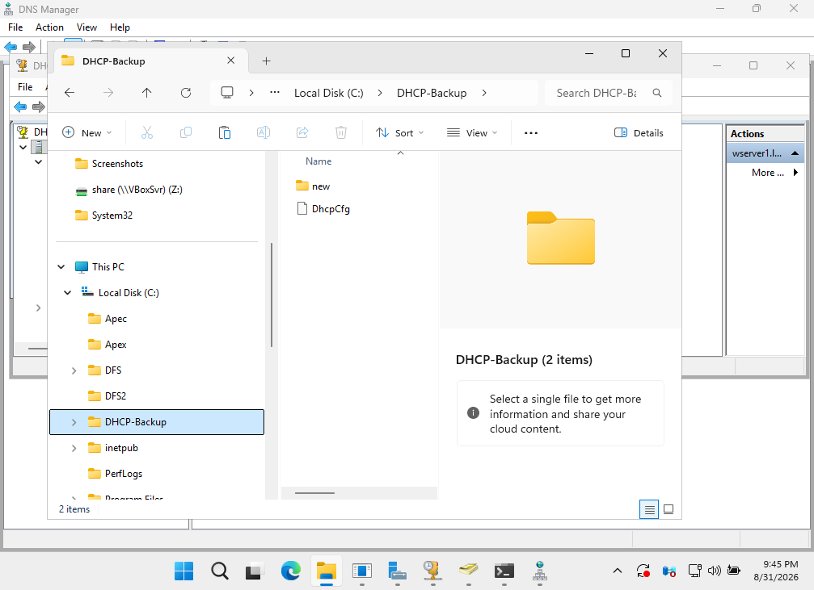

A restore was not performed against the working DHCP Server because doing so would unnecessarily modify a validated configuration.

The backup demonstrates awareness of DHCP recovery and configuration protection as part of normal server administration.

---

## 13. PowerShell Verification

The final DHCP configuration was validated using PowerShell.

### Interface Binding

```powershell
Get-DhcpServerv4Binding
```

Result:

```text
Ethernet 3   192.168.10.1   True
Ethernet     192.168.0.10   False
```

This confirms that DHCP is active only on the isolated LAB-NET interface.

### Scope Verification

```powershell
Get-DhcpServerv4Scope
```

The scope was confirmed as:

```text
Scope:          192.168.10.0
Subnet Mask:    255.255.255.0
State:          Active
Start Range:    192.168.10.100
End Range:      192.168.10.200
Lease Duration: 8 days
```

### Scope Options

```powershell
Get-DhcpServerv4OptionValue -ScopeId 192.168.10.0
```

The output confirmed:

```text
006 DNS Servers       → 192.168.0.10
015 DNS Domain Name   → London.local
```

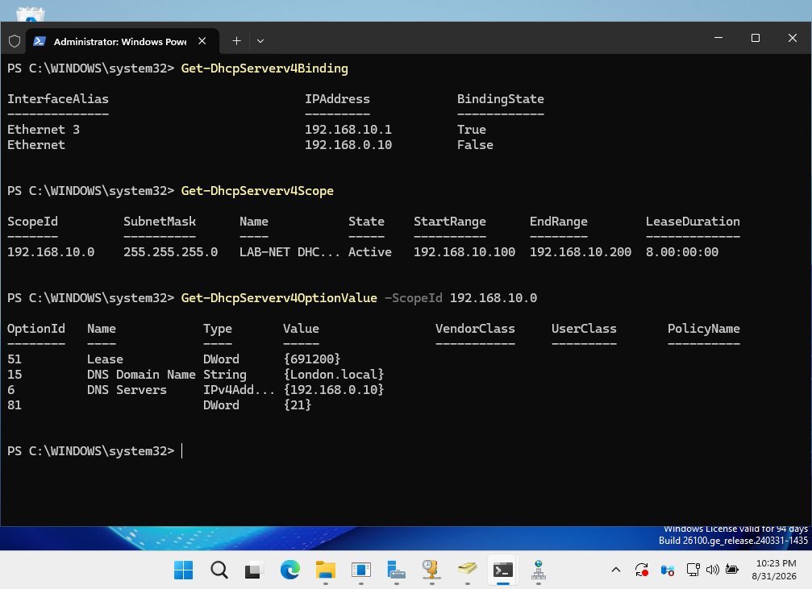

Using PowerShell alongside the graphical DHCP console provides an additional method of validating the server configuration.

---

## Troubleshooting and Design Decisions

Several practical issues were identified and resolved during the project.

### Multi-Homed DHCP Server

WSERVER1 contains multiple network interfaces.

Allowing DHCP to bind to the Bridged `192.168.0.10` interface could expose the lab DHCP service to the physical LAN.

**Resolution:** DHCP binding was disabled on the Bridged interface and retained only on the isolated `192.168.10.1` LAB-NET interface.

---

### DHCP Client Address Exclusions

The scope starts at:

```text
192.168.10.100
```

but `.100–.109` are excluded.

The first client therefore received:

```text
192.168.10.110
```

This verified that the exclusion configuration was functioning correctly.

---

### Multi-Homed Client and DNS Registration

The original HR client had two network adapters and already had an existing DNS identity associated with its primary AD network address.

Using the same hostname to test a second DHCP-controlled network introduced unnecessary ambiguity into Dynamic DNS testing.

**Resolution:** A separate single-interface client (`HR-2`) was created specifically for LAB-NET DHCP/DNS validation.

The new client successfully registered:

```text
HR-2.London.local → 192.168.10.111
```

and:

```text
192.168.10.111 → HR-2.London.local
```

This provided a clean test of DHCP-managed Dynamic DNS registration.

---

### Isolated Network and Default Gateway

LAB-NET does not contain a router.

Therefore:

```text
Option 003 Router
```

was intentionally not configured.

This prevents clients from receiving a default gateway that does not actually provide routing.

---

## Skills Demonstrated

This project demonstrates practical experience with:

- Windows Server DHCP
- Active Directory DHCP authorization
- IPv4 scope design
- DHCP exclusions
- DHCP leases
- DHCP reservations
- DHCP scope options
- Multi-homed Windows Server configuration
- DHCP interface binding
- Network isolation
- Active Directory service accounts
- Secure Dynamic DNS
- DHCP/DNS integration
- Forward and reverse DNS
- PTR records
- DHCP Server backup
- Windows client network troubleshooting
- PowerShell DHCP administration
- Configuration verification
- Troubleshooting multi-interface network environments

---

## Project Outcome

The final environment provides a functional and isolated Windows Server DHCP service for the LAB-NET network.

WSERVER1 successfully:

- Provides DHCP only through the dedicated LAB-NET interface
- Maintains an active `192.168.10.0/24` scope
- Enforces an address exclusion range
- Assigns IPv4 configuration to Windows clients
- Provides DNS server and DNS suffix information
- Supports DHCP reservations
- Performs secure Dynamic DNS updates
- Registers forward and reverse DNS records
- Uses dedicated credentials for DHCP DNS operations
- Maintains a DHCP configuration backup
- Can be inspected and validated through PowerShell

The project demonstrates both GUI-based Windows Server administration and command-line verification while maintaining isolation from the physical network.
