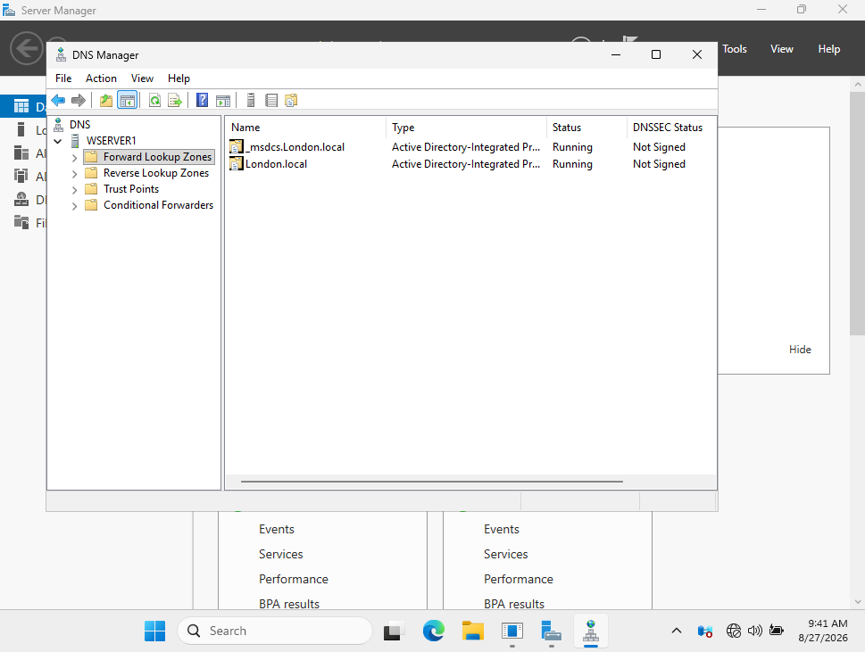
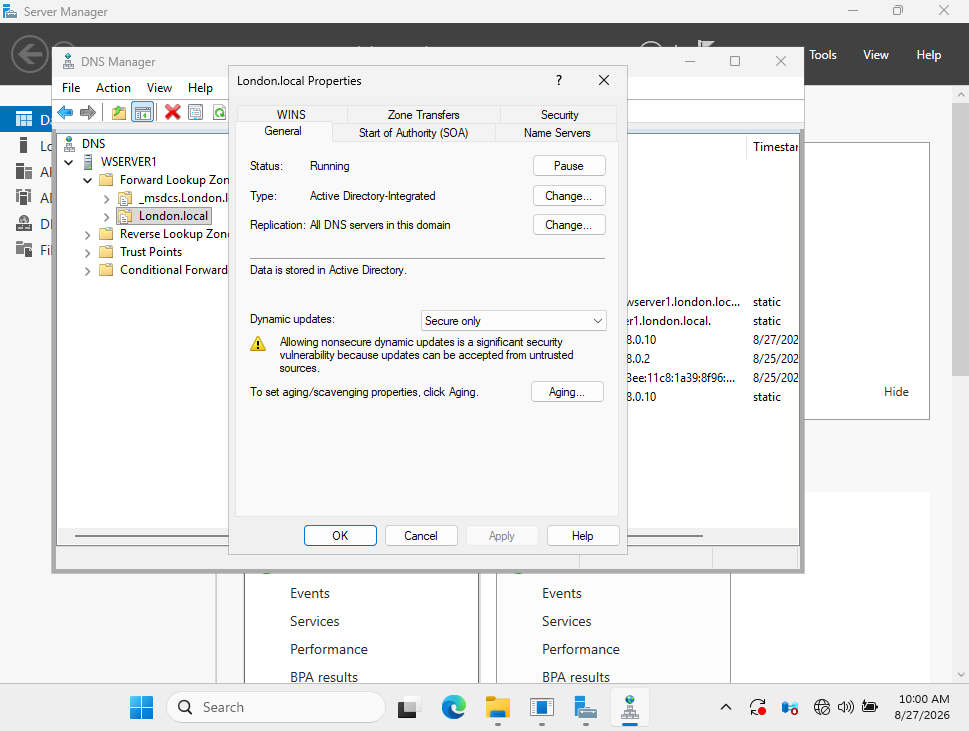
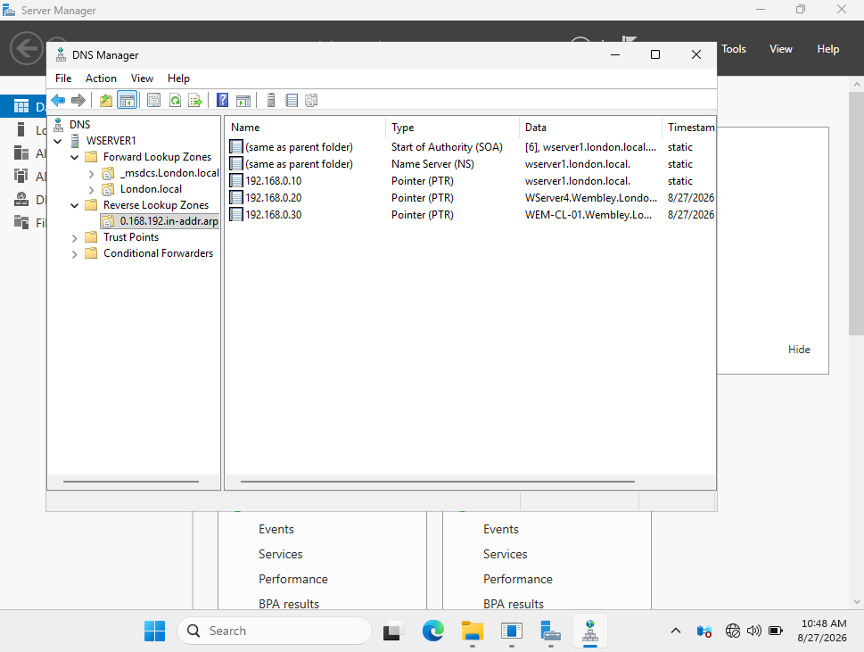
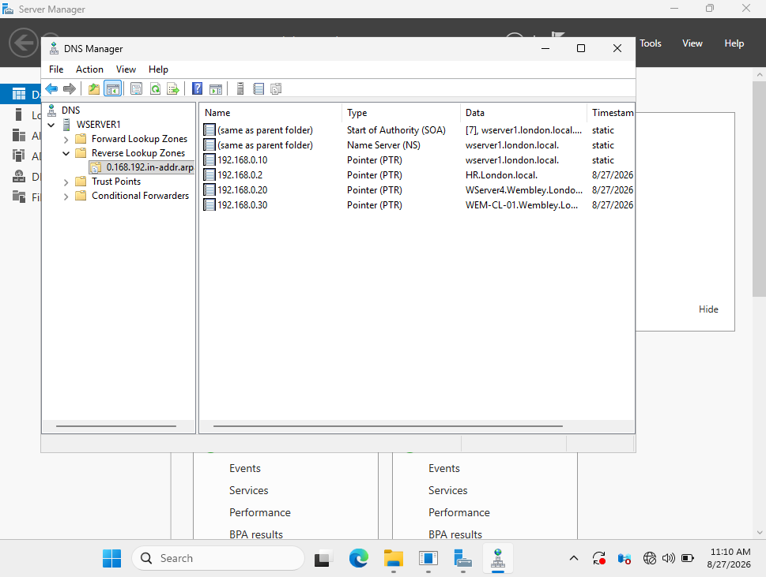
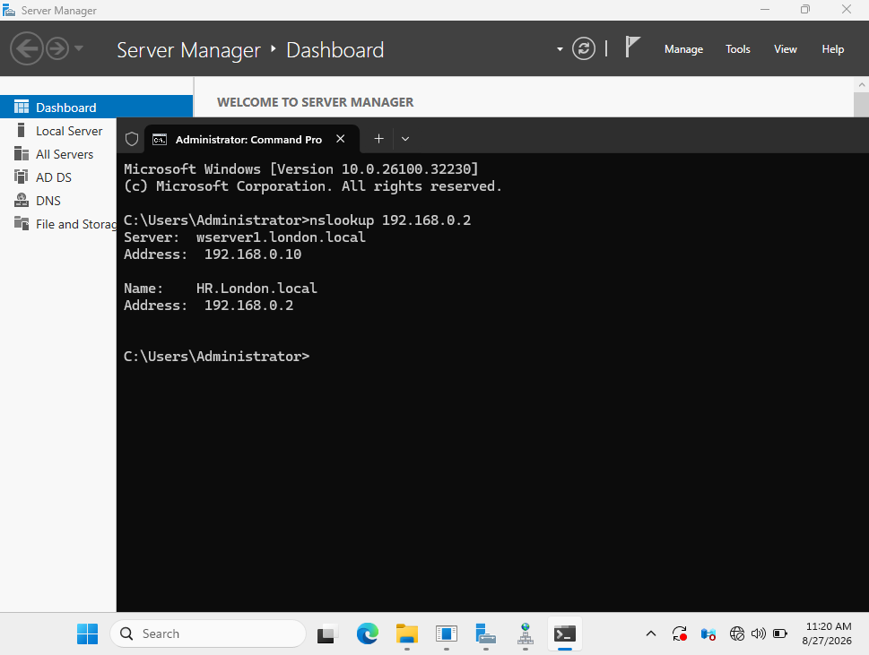
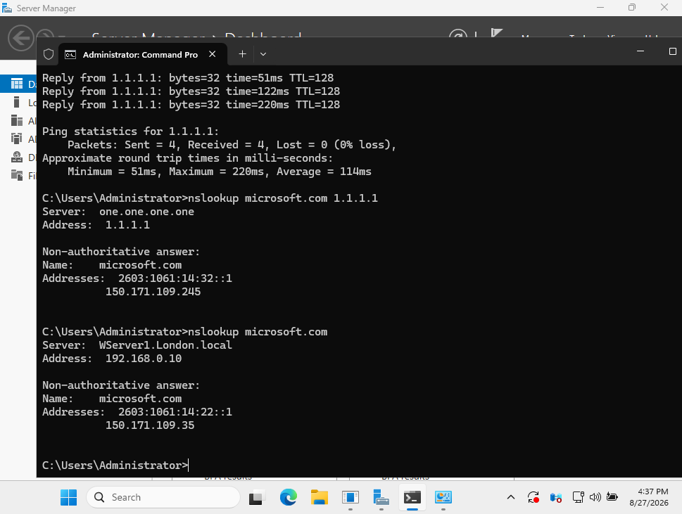
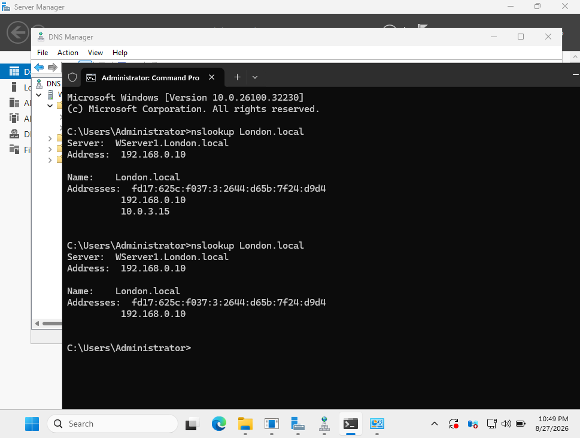
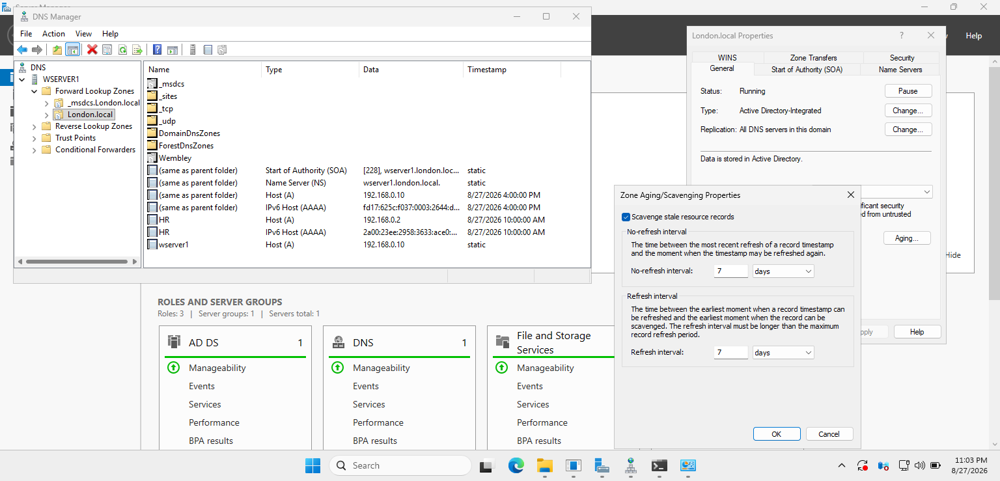
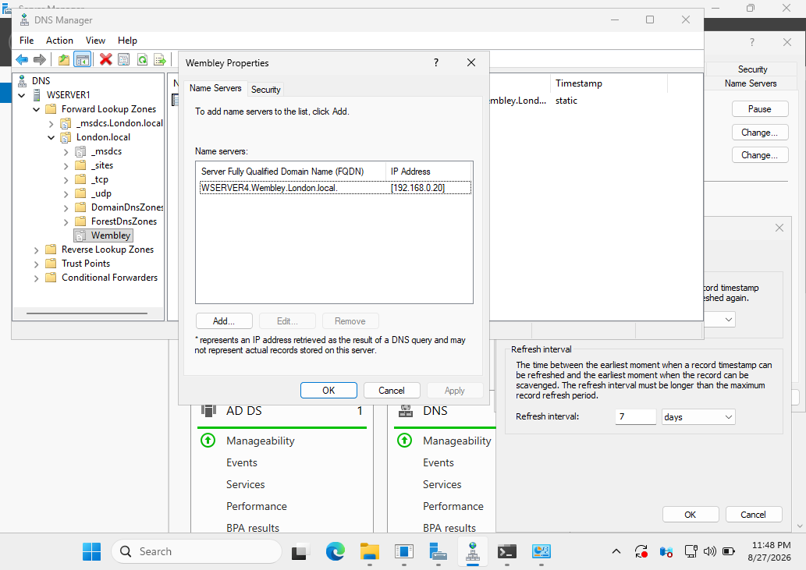

# DNS Infrastructure and Management

## Overview

This project demonstrates the configuration, administration, testing, and troubleshooting of DNS services in a Windows Server Active Directory environment.

The lab uses a hierarchical parent and child domain architecture with Active Directory-integrated DNS. The implementation includes secure dynamic updates, forward and reverse name resolution, PTR records, external DNS forwarding, DNS aging and scavenging, and parent-child DNS delegation.

The project also demonstrates troubleshooting of a real DNS registration issue caused by a multi-homed Domain Controller.

---

## Environment

| System | Role | Domain | IP Address |
|---|---|---|---|
| WSERVER1 | Domain Controller / DNS Server | London.local | 192.168.0.10 |
| WSERVER4 | Child Domain Controller / DNS Server | Wembley.London.local | 192.168.0.20 |
| HR | Domain Workstation | London.local | 192.168.0.2 |
| WEM-CL-01 | Child Domain Workstation | Wembley.London.local | 192.168.0.30 |

### DNS Architecture

```text
London.local
│
├── WSERVER1
│   ├── Domain Controller
│   ├── DNS Server
│   └── 192.168.0.10
│
└── Wembley.London.local
    │
    └── WSERVER4
        ├── Child Domain Controller
        ├── DNS Server
        └── 192.168.0.20
```

WSERVER1 provides DNS services for the `London.local` parent domain, while WSERVER4 provides DNS services for the `Wembley.London.local` child domain.

---

## Forward Lookup Zones

The DNS server on WSERVER1 contains the Active Directory DNS zones required by the `London.local` domain.

The Forward Lookup Zones include:

- `_msdcs.London.local`
- `London.local`

These zones provide hostname-to-IP address resolution and contain the DNS records required by Active Directory services.



---

## Active Directory-Integrated DNS

The `London.local` DNS zone is configured as an **Active Directory-integrated zone**.

Configuration:

- Zone type: Active Directory-Integrated
- Replication: All DNS servers in this domain
- Dynamic updates: Secure only
- DNS data stored in Active Directory

Using Active Directory-integrated DNS allows DNS information to participate in Active Directory replication instead of relying on traditional DNS zone transfers between domain DNS servers.

Secure dynamic updates restrict dynamic DNS record registration and modification to authenticated domain members.



---

## Reverse Lookup Zone and PTR Records

A reverse lookup zone was configured for the internal:

```text
192.168.0.0/24
```

network.

The corresponding reverse DNS zone is:

```text
0.168.192.in-addr.arpa
```

Reverse lookup zones provide **IP-address-to-hostname resolution** using Pointer (PTR) records.

PTR records were configured for infrastructure systems including:

```text
192.168.0.10 → wserver1.london.local
192.168.0.20 → WServer4.Wembley.London.local
192.168.0.30 → WEM-CL-01.Wembley.London.local
```



---

## Dynamic Client DNS Registration

The reverse lookup zone was also used to register client systems.

The HR workstation was registered with:

```text
192.168.0.2 → HR.London.local
```

The completed reverse lookup zone therefore contains PTR records for servers and domain workstations across the lab environment.



### Reverse Lookup Verification

Reverse DNS resolution for the HR workstation was tested using:

```cmd
nslookup 192.168.0.2
```

The DNS server successfully returned:

```text
Name:    HR.London.local
Address: 192.168.0.2
```

This verifies that the PTR record and reverse lookup zone are functioning correctly.



---

## External DNS Forwarding

The internal DNS infrastructure also needs to resolve names outside the Active Directory environment.

WSERVER1 was therefore configured to forward unresolved external DNS queries to an external DNS resolver.

Configured forwarder:

```text
1.1.1.1
```

WSERVER1 uses a secondary VirtualBox NAT network interface to provide Internet connectivity while the primary interface remains connected to the internal Active Directory network.

### Connectivity Test

External IP connectivity was verified using:

```cmd
ping 1.1.1.1
```

### Direct External DNS Test

The external resolver was tested directly:

```cmd
nslookup microsoft.com 1.1.1.1
```

### Internal DNS Forwarding Test

External resolution was then tested without specifying an external DNS server:

```cmd
nslookup microsoft.com
```

The query was sent to:

```text
WServer1.London.local
192.168.0.10
```

and WSERVER1 successfully resolved the external domain.

This verifies that domain systems can use the internal DNS server for DNS resolution while WSERVER1 handles external queries through DNS forwarding.



---

## Troubleshooting: Multi-Homed Domain Controller DNS Registration

### Issue

WSERVER1 required Internet connectivity while maintaining connectivity to the isolated Active Directory network.

A second VirtualBox NAT network adapter was added to provide Internet access.

WSERVER1 therefore had two network interfaces:

```text
Internal AD interface: 192.168.0.10
NAT interface:         10.0.3.15
```

After the NAT interface was added, its `10.0.3.15` address was dynamically registered in the `London.local` DNS zone.

Running:

```cmd
nslookup London.local
```

returned both:

```text
192.168.0.10
10.0.3.15
```

The NAT interface should not have been advertised to Active Directory clients as an address for the internal domain.

### Investigation

The DNS configuration of the secondary NAT network adapter was inspected under:

```text
IPv4 Properties
→ Advanced
→ DNS
```

The following option was enabled:

```text
Register this connection's addresses in DNS
```

This allowed the secondary NAT interface to dynamically register its address in the Active Directory DNS namespace.

### Root Cause

The secondary network adapter was participating in DNS registration.

As a result, WSERVER1 registered both its internal Active Directory address and its NAT address.

This could cause domain clients resolving `London.local` to receive an inappropriate interface address.

### Resolution

DNS registration was disabled on the NAT adapter by clearing:

```text
Register this connection's addresses in DNS
```

The unwanted:

```text
10.0.3.15
```

zone-apex Host (A) record was then removed from the `London.local` DNS zone.

### Verification

The query was repeated:

```cmd
nslookup London.local
```

Before the correction, DNS returned:

```text
192.168.0.10
10.0.3.15
```

After the correction, the NAT IPv4 address was no longer returned and the correct internal IPv4 address remained:

```text
192.168.0.10
```

The screenshot below documents the DNS result before and after the configuration change.



---

## DNS Aging and Scavenging

DNS Aging and Scavenging was configured to help automatically remove stale dynamically registered DNS records.

The `London.local` zone was configured with:

```text
Scavenge stale resource records: Enabled

No-refresh interval: 7 days
Refresh interval:    7 days
```

Automatic scavenging was also enabled at the DNS server level with a:

```text
Scavenging period: 7 days
```

### How It Works

The **No-refresh interval** prevents unnecessary timestamp updates shortly after a record has been registered or refreshed.

The **Refresh interval** provides a period during which an existing dynamic record can refresh its timestamp.

If a dynamic record becomes sufficiently old and is no longer refreshed, it becomes eligible for scavenging.

Dynamic records can be identified by their timestamps, while manually configured static records are shown as:

```text
static
```

This helps prevent obsolete dynamically registered records from accumulating in the DNS database.



---

## Parent-Child DNS Delegation

The Active Directory forest contains a hierarchical DNS namespace:

```text
London.local
└── Wembley.London.local
```

WSERVER1 is authoritative for the parent `London.local` DNS namespace, while WSERVER4 provides DNS services for the `Wembley.London.local` child domain.

A DNS delegation exists in the parent zone for:

```text
Wembley
```

The delegated Name Server is:

```text
WSERVER4.Wembley.London.local
```

with the address:

```text
192.168.0.20
```

This allows the parent DNS infrastructure to identify the DNS server responsible for the child namespace.

The delegation therefore provides a hierarchical DNS relationship rather than requiring WSERVER1 to host the child domain's DNS records directly.



### Delegation Verification

Child-domain resolution can be verified from WSERVER1 using:

```cmd
nslookup WServer4.Wembley.London.local
```

The query resolves:

```text
WServer4.Wembley.London.local
→ 192.168.0.20
```

This confirms that systems using the parent DNS infrastructure can locate resources within the child DNS namespace.

---

## DNS Testing and Validation

The completed DNS infrastructure was tested using multiple DNS queries.

### Forward Resolution

```cmd
nslookup London.local
```

Verifies resolution of the parent Active Directory DNS namespace.

### Reverse Resolution

```cmd
nslookup 192.168.0.2
```

Verifies PTR resolution of the HR workstation.

### Child Domain Resolution

```cmd
nslookup WServer4.Wembley.London.local
```

Verifies resolution across the parent-child DNS hierarchy.

### External Resolution

```cmd
nslookup microsoft.com
```

Verifies external DNS resolution through WSERVER1.

### External Connectivity

```cmd
ping 1.1.1.1
```

Verifies that WSERVER1 has external network connectivity independently of DNS resolution.

---

## Troubleshooting Methodology

The multi-homed Domain Controller issue was resolved using a structured troubleshooting process:

1. Identify unexpected DNS resolution results.
2. Compare registered addresses with the server's network interfaces.
3. Inspect DNS registration settings on each network adapter.
4. Identify the secondary NAT interface as the source of the unwanted record.
5. Disable DNS registration on the NAT interface.
6. Remove the incorrect DNS record.
7. Repeat DNS queries to verify the correction.

This demonstrates the importance of validating DNS registration when Domain Controllers use multiple network interfaces.

---

## Skills Demonstrated

This project demonstrates hands-on experience with:

- Windows Server DNS Administration
- Active Directory-Integrated DNS
- Active Directory DNS Architecture
- Forward Lookup Zones
- Reverse Lookup Zones
- A and PTR Records
- Secure Dynamic DNS Updates
- Dynamic Client Registration
- DNS Forwarders
- External DNS Resolution
- DNS Aging and Scavenging
- DNS Delegation
- Parent and Child DNS Namespaces
- Multi-Homed Domain Controller Configuration
- DNS Troubleshooting
- `nslookup` Testing and Verification
- Windows Server Network Troubleshooting

---

## Project Outcome

The completed DNS infrastructure provides name resolution for the `London.local` parent domain and the `Wembley.London.local` child domain.

The lab demonstrates both DNS configuration and operational troubleshooting, including internal and external resolution, reverse DNS, secure dynamic registration, stale-record management, hierarchical DNS delegation, and correction of an unwanted DNS registration caused by a secondary network interface.

The final environment provides a practical example of administering DNS within a multi-domain Windows Server Active Directory lab.
