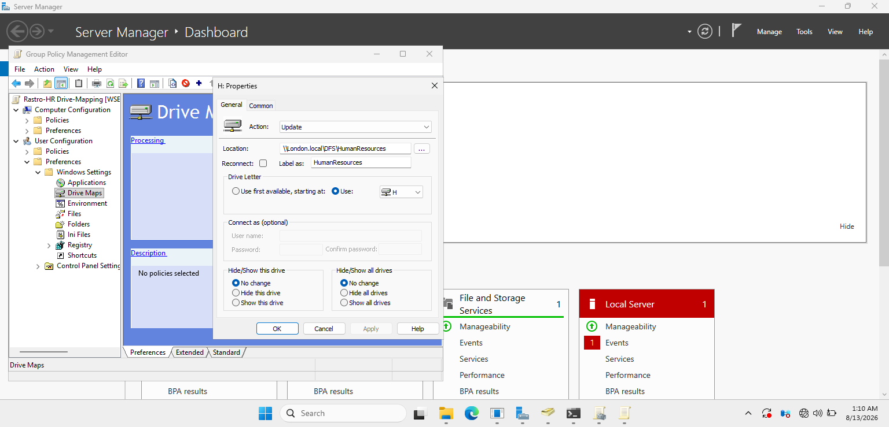
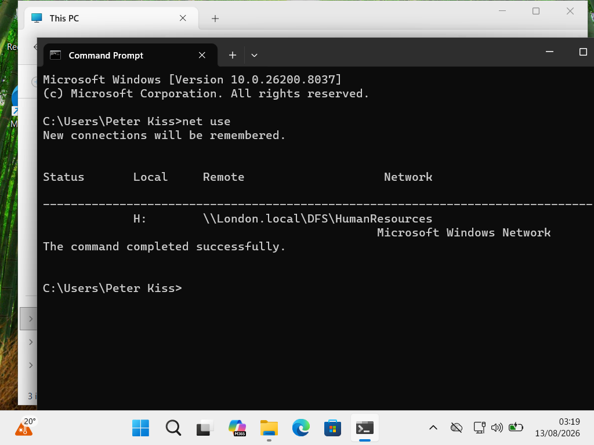
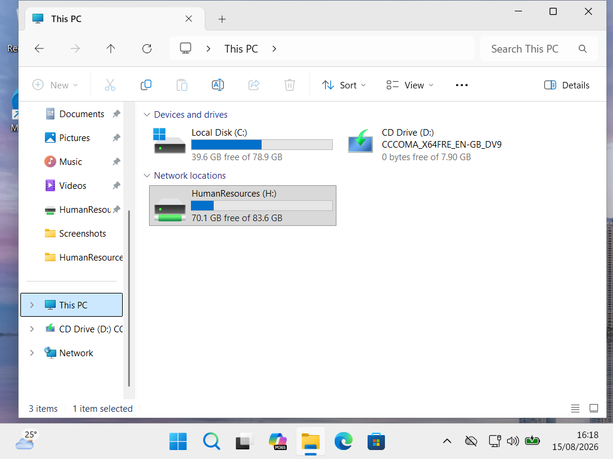

# HR Network Drive Mapping
## Objective

The objective of this project was to automatically provide HR users with access to the HumanResources shared folder through Group Policy.

The shared folder is accessed through a DFS namespace, providing users with a consistent network path.

## Configuration

- **GPO:** Rastro - HR Drive Mapping
- **Drive Letter:** H:
- **Drive Label:** HumanResources
- **DFS Path:** `\\London.local\DFS\HumanResources`
- **Group Policy Preference Action:** Update
- **Target:** HR users

## Implementation
### GPO Configuration

The drive mapping was configured through Group Policy Preferences on the domain controller.

The drive mapping was configured using Group Policy Preferences and linked to the Organizational Unit containing the HR user accounts.

When an HR user signs in to a domain-joined workstation, the H: drive is automatically mapped to the HumanResources DFS path.

## Testing and Verification

### Commands Used

- `gpupdate /force` – forced an immediate Group Policy refresh
- `gpresult /r` – verified that the user Group Policy was applied
- `net use` – verified the mapped network drive and DFS path

### Additional Verification

- Verified the H: drive in Windows File Explorer
- Tested file and folder creation using HR test accounts
- Verified NTFS and share permissions
- Verified Active Directory security group membership
- Confirmed access through the DFS namespace

### Client-Side Verification

The `net use` command confirmed that the H: drive was mapped to the DFS namespace path.

The mapped HumanResources drive was also verified in Windows File Explorer.

The drive mapping and user access were tested on a domain-joined Windows client.

## Result

HR users successfully received the H: drive automatically after signing in, providing centralized and permission-controlled access to the HumanResources shared folder.
