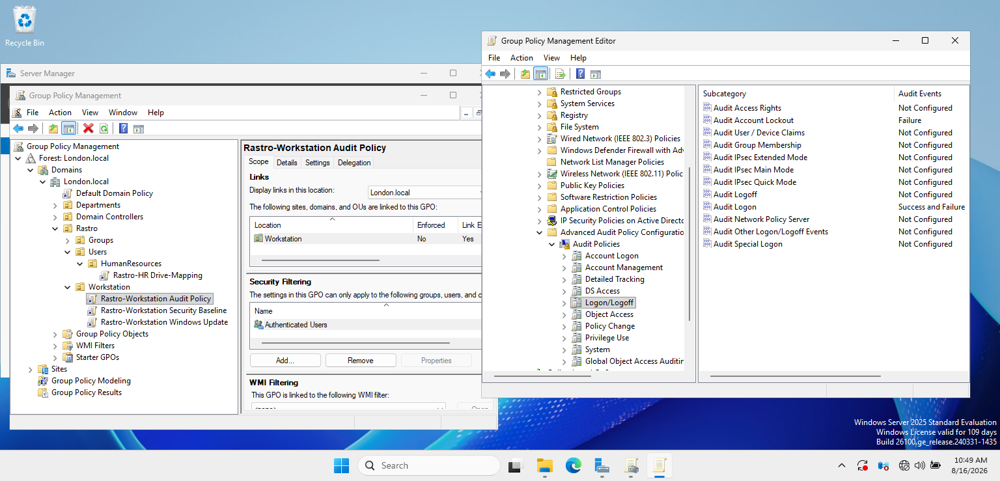
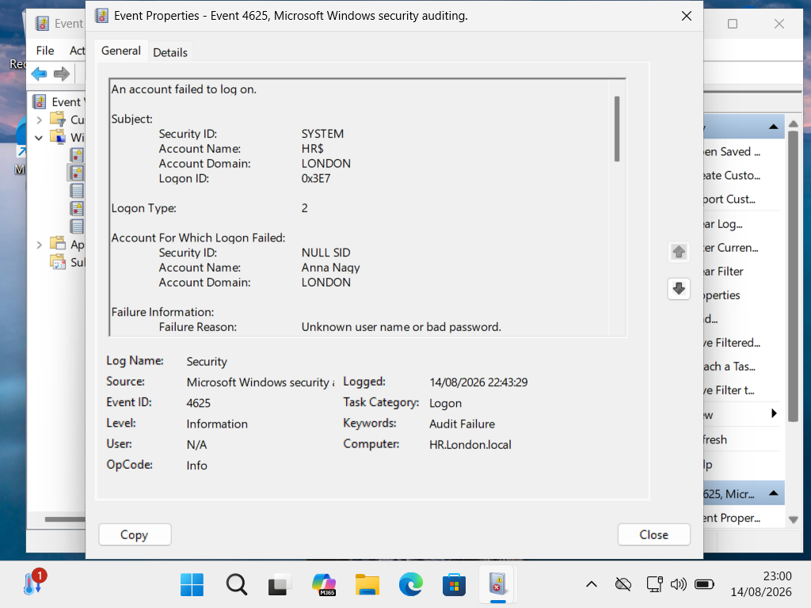

# Windows Security Auditing

## Objective

The objective of this project was to centrally configure security auditing on domain-joined Windows workstations using Group Policy and to monitor authentication events through the Windows Security Event Log.

## Configuration

The **Rastro - Workstation Audit Policy** GPO was linked to the Workstations Organizational Unit.

Advanced Audit Policy Configuration was used to configure the following settings:

### Audit Logon

- **Success:** Enabled
- **Failure:** Enabled

### Audit Account Lockout

- **Failure:** Enabled

These settings allow successful and failed authentication activity to be recorded in the Windows Security Event Log.

## Implementation

The audit settings were configured under:

`Computer Configuration → Policies → Windows Settings → Security Settings → Advanced Audit Policy Configuration`

The GPO was applied to domain-joined workstations through the Workstations OU.

### GPO Configuration

Advanced auditing was centrally configured through the Rastro-Workstation Audit Policy and linked to the Workstation OU.

The policy records both successful and failed logon attempts and audits account lockout failures.

## Testing and Verification

The applied audit configuration was verified using Group Policy Results on the Windows client.

A failed interactive logon was then intentionally generated using a test domain account.

The resulting event was located in:

`Event Viewer → Windows Logs → Security`

### Failed Logon Event

The generated event contained:

- **Event ID:** 4625
- **Event:** An account failed to log on
- **Failure Reason:** Unknown user name or bad password
- **Logon Type:** 2

Logon Type 2 identified the authentication attempt as an interactive logon at the workstation.

## Troubleshooting

During testing, Group Policy processing initially failed because the workstation clock was not correctly synchronized with the domain environment.

The workstation time zone was corrected and Windows Time synchronization was restored. Group Policy then updated successfully.

### Client-Side Verification

A failed interactive logon attempt was verified in the Windows Security event log.

Event ID 4625 confirmed the failed authentication attempt for the domain test account, with Logon Type 2 and the failure reason recorded as an unknown user name or bad password.

## Result

Advanced security auditing was successfully deployed through Group Policy.

Failed interactive authentication attempts were recorded in the Windows Security Event Log and could be investigated using Event Viewer, demonstrating centralized audit configuration and practical Windows security event analysis.
