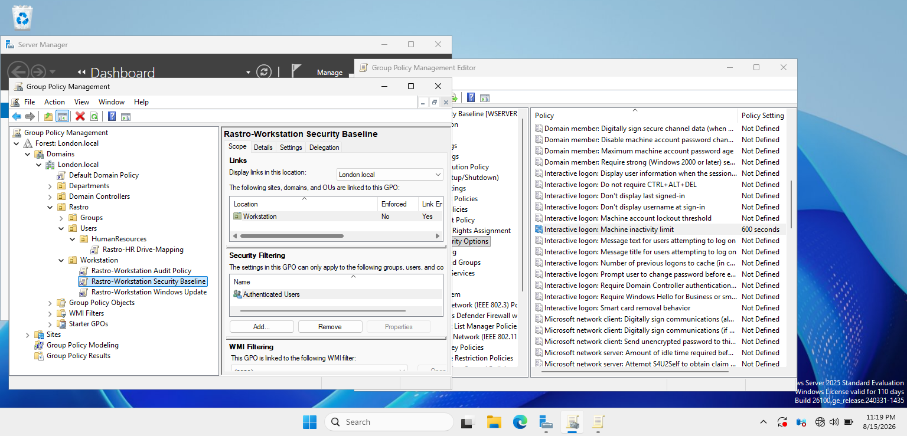
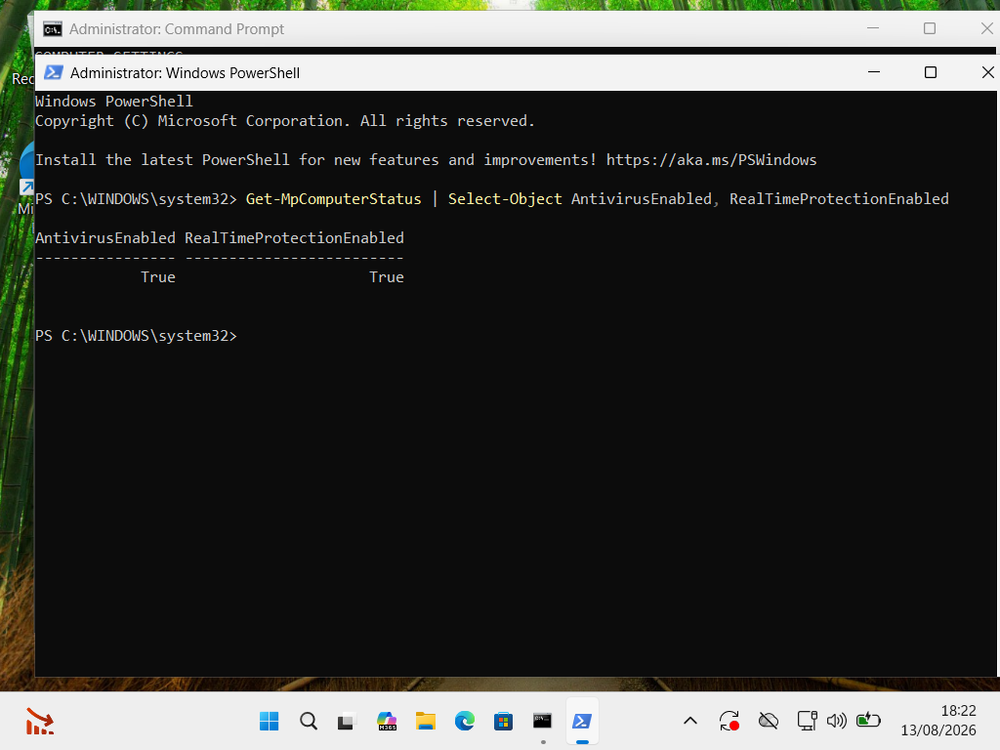
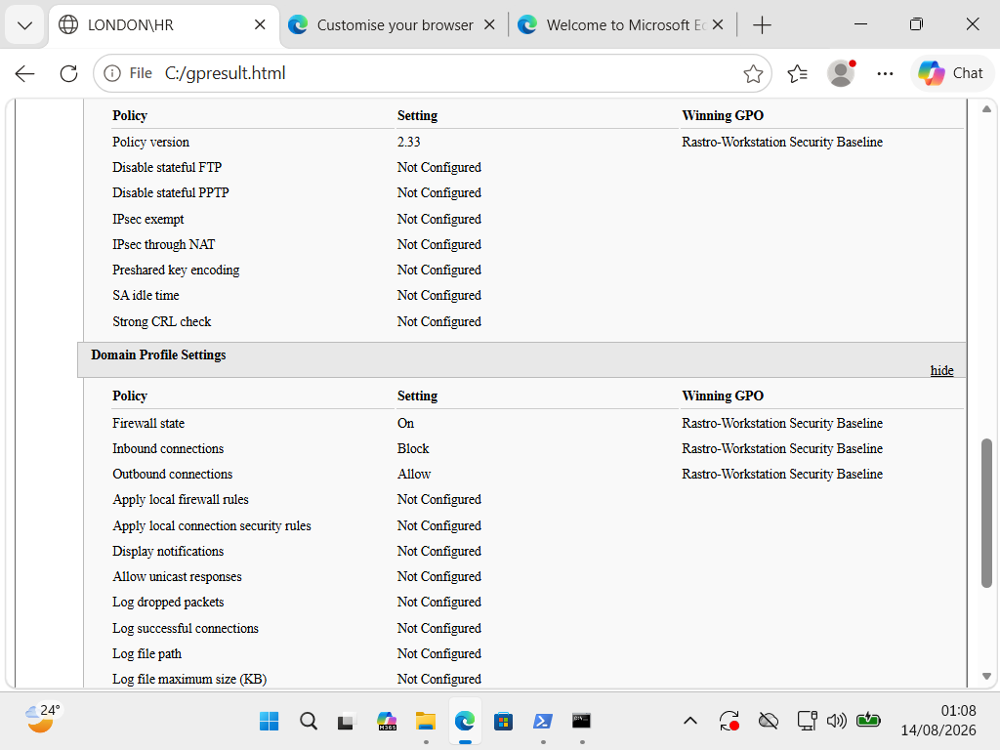

# Workstation Security Baseline

## Objective

The objective of this project was to centrally apply security settings to domain-joined Windows workstations using Group Policy.

A workstation security baseline was created and linked to the Workstations Organizational Unit.

## Configuration

The following security controls were configured through the **Rastro - Workstation Security Baseline** GPO:

### Automatic Screen Lock

- **Machine inactivity limit:** 600 seconds (10 minutes)
- Automatically locks an inactive workstation

### Microsoft Defender

- Microsoft Defender Antivirus kept enabled
- Real-time protection kept enabled

### Windows Defender Firewall

The Domain firewall profile was centrally configured with:

- **Firewall State:** On
- **Inbound Connections:** Block
- **Outbound Connections:** Allow

## Implementation
### GPO Configuration

The Workstation Security Baseline was centrally configured through Group Policy and linked to the Workstations Organizational Unit.

The security baseline GPO was linked to the Workstations Organizational Unit so that domain workstation computer accounts within the OU receive the security configuration automatically.

This allows workstation security settings to be managed centrally rather than configured individually on each computer.

## Testing and Verification
### Client-Side Verification

Microsoft Defender Antivirus and Real-Time Protection were verified on the domain-joined workstation using PowerShell.

The effective Domain firewall configuration was verified using a Group Policy Results report. The report confirmed that the firewall was enabled, inbound connections were blocked, outbound connections were allowed, and the winning GPO was the Rastro Workstation Security Baseline.

The policy was tested on a domain-joined Windows client.

### Commands Used

- `gpupdate /force` – forced an immediate Group Policy refresh
- `gpresult /r /scope computer` – verified that the workstation security GPO was applied
- `Get-MpComputerStatus` – verified Microsoft Defender and real-time protection status
- `Get-NetFirewallProfile` – checked the Windows Firewall Domain profile

### Additional Verification

- Verified the applied GPO using Group Policy Results
- Confirmed Microsoft Defender Antivirus was enabled
- Confirmed real-time protection was enabled
- Confirmed the Windows Defender Firewall Domain profile was enabled
- Verified the effective firewall configuration using a detailed `gpresult` HTML report

## Result

The domain-joined workstation successfully received the centralized security baseline, including automatic screen locking, Microsoft Defender protection, and Windows Defender Firewall configuration.
