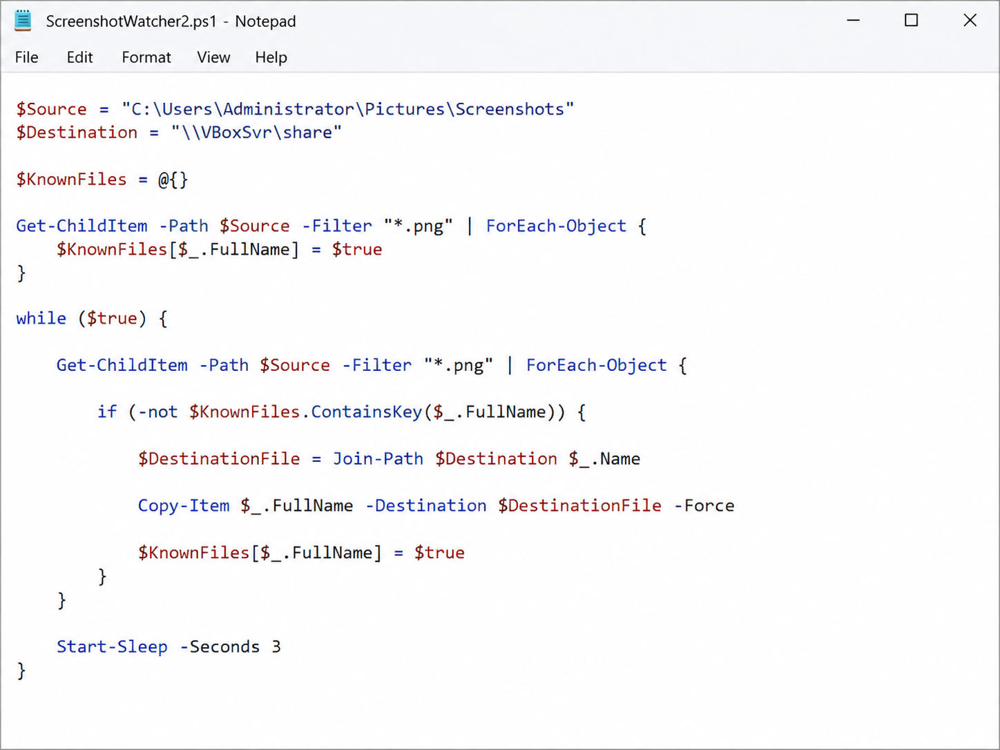
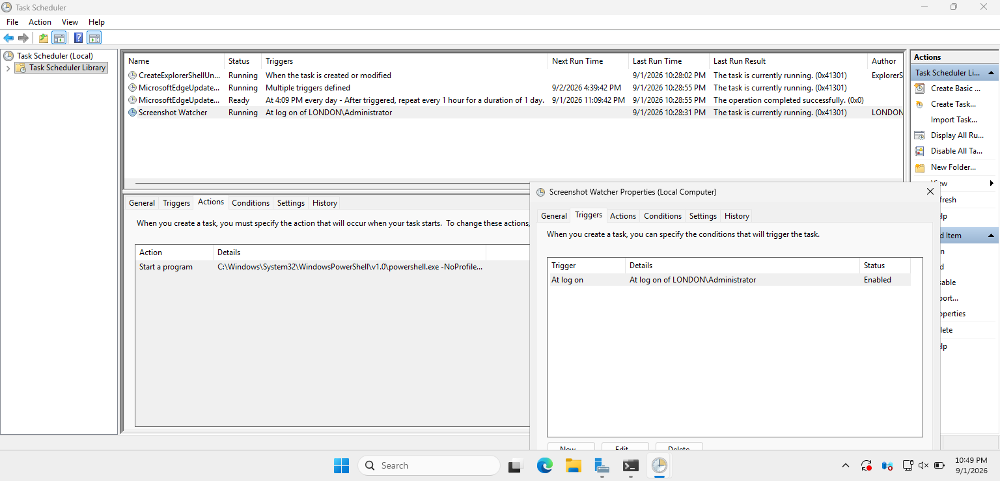
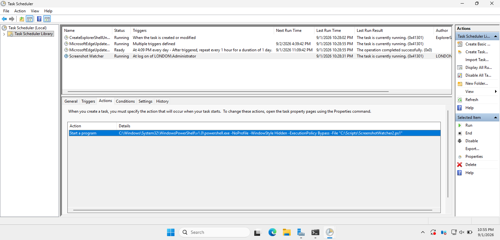
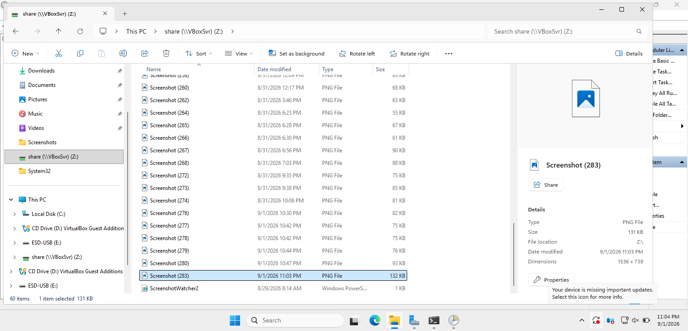

# PowerShell Screenshot Watcher Automation

## Overview

This project demonstrates the use of PowerShell to automate a repetitive file-management task in a Windows Server homelab environment.

The script monitors the Windows screenshot directory for newly created PNG files and automatically copies them to a VirtualBox shared folder.

Windows Task Scheduler is used to start the PowerShell script automatically when the administrator logs on, allowing the automation to operate without requiring manual script execution.

---

## Project Objective

During the development and documentation of the Windows Server homelab, screenshots are frequently created as evidence of configuration, testing, and troubleshooting.

Manually transferring each screenshot from the virtual machine to the host system would be repetitive.

The objective of this project was therefore to automate this process using PowerShell.

The solution:

- Monitors the Windows screenshot directory
- Identifies newly created PNG files
- Copies only new screenshots
- Transfers them to a VirtualBox shared folder
- Runs automatically after administrator logon
- Operates without displaying a PowerShell window

---

## PowerShell Script

The script uses two locations:

```powershell
$Source = "C:\Users\Administrator\Pictures\Screenshots"
$Destination = "\\VBoxSvr\share"
```

The source directory contains screenshots created inside the Windows Server virtual machine.

The destination is a VirtualBox shared folder that provides access to the files from the host system.

The script first records screenshots that already exist when the script starts.

```powershell
$KnownFiles = @{}

Get-ChildItem -Path $Source -Filter "*.png" | ForEach-Object {
    $KnownFiles[$_.FullName] = $true
}
```

This prevents existing screenshots from being treated as newly created files.

The script then continuously checks the directory for new PNG files.

```powershell
while ($true) {

    Get-ChildItem -Path $Source -Filter "*.png" | ForEach-Object {

        if (-not $KnownFiles.ContainsKey($_.FullName)) {

            $DestinationFile = Join-Path $Destination $_.Name

            Copy-Item $_.FullName -Destination $DestinationFile -Force

            $KnownFiles[$_.FullName] = $true
        }
    }

    Start-Sleep -Seconds 3
}
```

A three-second delay reduces unnecessary continuous file-system polling while still allowing screenshots to be transferred almost immediately.



---

## Automatic Execution with Task Scheduler

To remove the need to manually launch the script, Windows Task Scheduler was configured to start the automation when the administrator logs on.

The task is configured with the following trigger:

```text
Trigger: At log on
User: LONDON\Administrator
Status: Enabled
```

The running task confirms that the Screenshot Watcher automation is active after logon.



---

## PowerShell Task Action

The Scheduled Task launches Windows PowerShell and executes the Screenshot Watcher script.

The configured command is:

```text
powershell.exe -NoProfile -WindowStyle Hidden -ExecutionPolicy Bypass -File "C:\Scripts\ScreenshotWatcher2.ps1"
```

The options provide the following behavior:

- `-NoProfile` prevents user PowerShell profiles from affecting script execution.
- `-WindowStyle Hidden` allows the automation to run without leaving a PowerShell window open.
- `-ExecutionPolicy Bypass` allows the scheduled script to execute without changing the system-wide execution policy.
- `-File` specifies the PowerShell script that Task Scheduler should execute.



---

## Automation Testing

The completed automation was tested by creating a new screenshot inside the virtual machine.

After the screenshot was created, the PowerShell script detected the new PNG file and automatically copied it to the configured VirtualBox shared folder.

The destination folder:

```text
\\VBoxSvr\share
```

contained the newly created screenshot shortly after it was captured.

This verified the complete automation workflow:

```text
Screenshot Created
        ↓
PowerShell Detects New PNG File
        ↓
New File Identified
        ↓
Copy-Item Executes
        ↓
VirtualBox Shared Folder
        ↓
Screenshot Available to Host System
```



---

## Troubleshooting

During the initial Scheduled Task configuration, the automation did not start correctly after a system restart.

The issue was traced to an incorrect PowerShell script name/path configured in the Task Scheduler action.

The task action was corrected to reference:

```text
C:\Scripts\ScreenshotWatcher2.ps1
```

After correcting the configuration, the task successfully launched the script automatically at logon.

This troubleshooting process demonstrated the importance of validating script paths, Scheduled Task actions, and execution behavior when implementing PowerShell automation.

---

## Skills Demonstrated

This project demonstrates practical experience with:

- PowerShell scripting
- PowerShell variables and hash tables
- `Get-ChildItem`
- `ForEach-Object`
- Conditional logic
- `Join-Path`
- `Copy-Item`
- File system automation
- UNC paths
- Windows Task Scheduler
- Automated PowerShell execution
- VirtualBox shared folders
- Script troubleshooting
- Automation testing and validation

---

## Project Outcome

The completed solution automatically transfers newly created screenshots from the Windows Server virtual machine to a VirtualBox shared folder.

The automation removes a repetitive manual file-transfer task and demonstrates how PowerShell can be combined with Windows Task Scheduler to create a simple, persistent administrative workflow.
