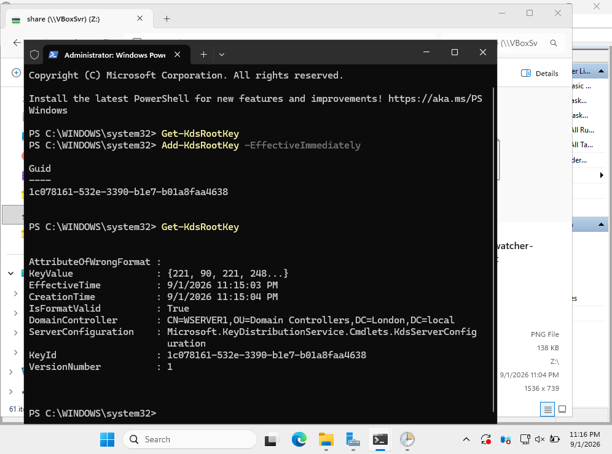
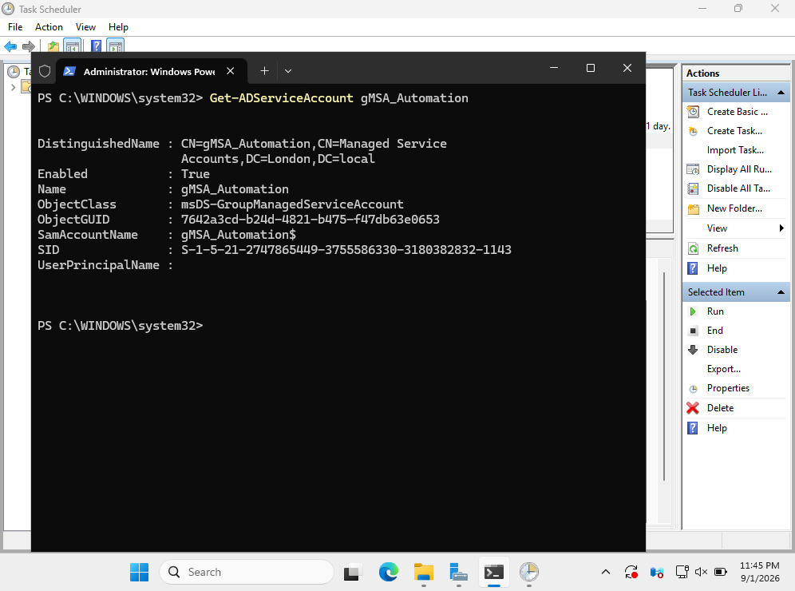
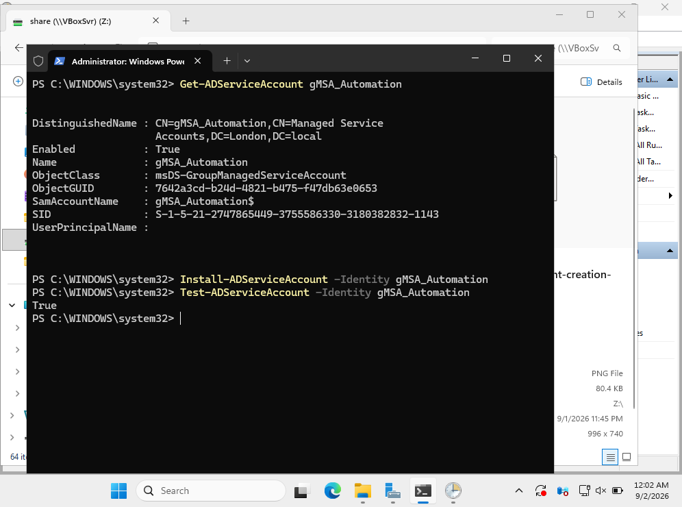
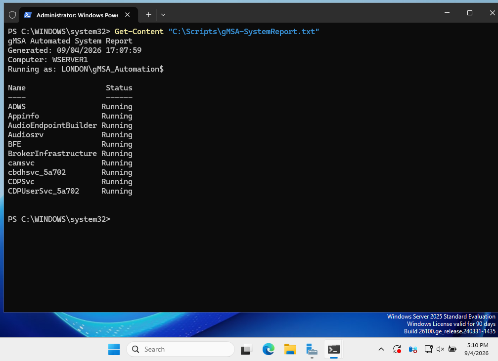
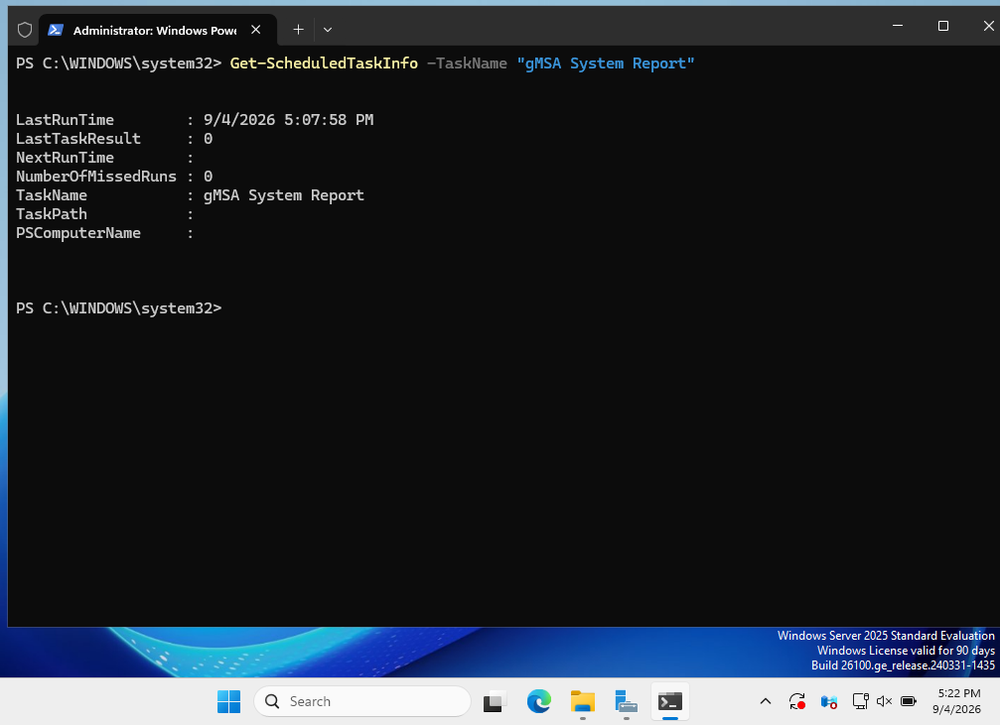

# gMSA Service Account Automation

## Overview

This project demonstrates the deployment and practical use of a **Group Managed Service Account (gMSA)** in a Windows Server Active Directory environment.

The objective was to create a dedicated service identity whose password is automatically managed by Active Directory and use that identity to run a PowerShell-based Scheduled Task.

The project demonstrates:

- KDS Root Key configuration
- gMSA creation with PowerShell
- Restricting managed password retrieval to an authorized server
- Installing and validating a gMSA
- PowerShell scripting
- Scheduled Task automation
- Running an automated task under a managed service identity
- Verification and troubleshooting

---

## Lab Environment

| Component | Configuration |
|---|---|
| Active Directory Domain | `London.local` |
| Domain Controller | `WSERVER1` |
| gMSA | `gMSA_Automation$` |
| Authorized Host | `WSERVER1` |
| PowerShell Script | `C:\Scripts\gMSA-SystemReport.ps1` |
| Scheduled Task | `gMSA System Report` |
| Report Output | `C:\Scripts\gMSA-SystemReport.txt` |

---

## Project Workflow

The project follows this workflow:

```text
KDS Root Key
      ↓
gMSA Creation
      ↓
Authorize WSERVER1
      ↓
Install and Validate gMSA
      ↓
PowerShell System Report
      ↓
Scheduled Task
      ↓
Run as gMSA_Automation$
      ↓
Verify Successful Execution
```

---

# 1. KDS Root Key Configuration

Group Managed Service Accounts rely on the Active Directory **Key Distribution Service (KDS)** infrastructure to generate managed passwords.

The existing KDS Root Key configuration was first checked:

```powershell
Get-KdsRootKey
```

A KDS Root Key was then created for the lab environment.

```powershell
Add-KdsRootKey -EffectiveTime ((Get-Date).AddHours(-10))
```

The configuration was verified with:

```powershell
Get-KdsRootKey
```

The returned KDS Root Key information confirmed that the key was present and valid.



> **Lab note:** A backdated effective time was used in this isolated lab environment so the KDS Root Key could be used for gMSA testing without waiting for the normal Active Directory propagation period.

---

# 2. gMSA Account Creation

Before creating the gMSA, the WSERVER1 computer object was verified in Active Directory:

```powershell
Get-ADComputer WSERVER1
```

The managed service account was then created:

```powershell
New-ADServiceAccount `
    -Name "gMSA_Automation" `
    -DNSHostName "gMSA_Automation.London.local" `
    -PrincipalsAllowedToRetrieveManagedPassword "WSERVER1$"
```

The `PrincipalsAllowedToRetrieveManagedPassword` parameter controls which computer or computers are permitted to retrieve the managed password.

For this project, WSERVER1 was authorized to use the gMSA.

The account was verified with:

```powershell
Get-ADServiceAccount gMSA_Automation
```

The output confirmed that `gMSA_Automation` existed, was enabled, and was identified as a Group Managed Service Account.



---

# 3. Installing and Validating the gMSA

The gMSA was installed on WSERVER1:

```powershell
Install-ADServiceAccount -Identity gMSA_Automation
```

The installation was then tested:

```powershell
Test-ADServiceAccount -Identity gMSA_Automation
```

The command returned:

```text
True
```

This confirmed that WSERVER1 could successfully use the managed service account.



---

# 4. PowerShell System Report

To demonstrate a practical use case for the gMSA, a PowerShell script was created to generate a basic Windows Server system report.

Script location:

```text
C:\Scripts\gMSA-SystemReport.ps1
```

The script records:

- Report generation time
- Computer name
- Windows security identity executing the script
- Running Windows services

Example implementation:

```powershell
$OutputFile = "C:\Scripts\gMSA-SystemReport.txt"

"gMSA Automated System Report" | Out-File $OutputFile
"Generated: $(Get-Date)" | Out-File $OutputFile -Append
"Computer: $env:COMPUTERNAME" | Out-File $OutputFile -Append
"Running as: $([System.Security.Principal.WindowsIdentity]::GetCurrent().Name)" |
    Out-File $OutputFile -Append

Get-Service |
    Where-Object Status -eq "Running" |
    Select-Object -First 10 Name, Status |
    Out-File $OutputFile -Append
```

The following part of the script is especially important:

```powershell
[System.Security.Principal.WindowsIdentity]::GetCurrent().Name
```

It records the Windows identity that actually executed the script.

This allows us to verify whether the script was executed by the Administrator account or by the gMSA.

---

# 5. PowerShell Execution Policy Troubleshooting

During manual testing, PowerShell initially prevented the unsigned script from running because of the server's configured execution policy.

The error included:

```text
PSSecurityException
UnauthorizedAccess
```

Instead of permanently changing the machine-wide execution policy, the script was tested in a separate PowerShell process using:

```powershell
powershell.exe -NoProfile -ExecutionPolicy Bypass -File "C:\Scripts\gMSA-SystemReport.ps1"
```

This allowed the script to be tested without permanently weakening the server-wide execution policy.

The generated report was then checked:

```powershell
Get-Content "C:\Scripts\gMSA-SystemReport.txt"
```

During manual testing, the report showed:

```text
Running as: LONDON\Administrator
```

This confirmed that the script itself worked correctly before configuring it to run under the gMSA identity.

---

# 6. Creating the Scheduled Task Action

The Scheduled Task was created using PowerShell rather than manually through the Task Scheduler GUI.

First, the task action was defined:

```powershell
$Action = New-ScheduledTaskAction `
    -Execute "PowerShell.exe" `
    -Argument '-NoProfile -ExecutionPolicy Bypass -File "C:\Scripts\gMSA-SystemReport.ps1"'
```

This action launches PowerShell and executes the system-report script.

Using `-NoProfile` helps provide a more predictable execution environment because user-specific PowerShell profiles are not loaded.

---

# 7. Configuring the gMSA Task Principal

A Scheduled Task principal was created using the managed service account:

```powershell
$Principal = New-ScheduledTaskPrincipal `
    -UserId 'LONDON\gMSA_Automation$' `
    -LogonType Password `
    -RunLevel Highest
```

The important security identity is:

```text
LONDON\gMSA_Automation$
```

The `$` suffix identifies the managed service account security principal.

The task is therefore configured to use the dedicated service identity rather than the interactive Administrator account.

---

# 8. Registering the Scheduled Task

The task was registered using the previously created Action and Principal objects:

```powershell
Register-ScheduledTask `
    -TaskName "gMSA System Report" `
    -Action $Action `
    -Principal $Principal `
    -Description "Runs a PowerShell system report using the gMSA_Automation account."
```

The task was then verified:

```powershell
Get-ScheduledTask -TaskName "gMSA System Report"
```

The task principal configuration could also be inspected using:

```powershell
(Get-ScheduledTask -TaskName "gMSA System Report").Principal
```

This confirmed that the task was associated with:

```text
gMSA_Automation$
```

---

# 9. Testing Execution Under the gMSA

Before the final test, the previous report file was removed:

```powershell
Remove-Item "C:\Scripts\gMSA-SystemReport.txt"
```

The removal was verified:

```powershell
Test-Path "C:\Scripts\gMSA-SystemReport.txt"
```

Result:

```text
False
```

The Scheduled Task was then started:

```powershell
Start-ScheduledTask -TaskName "gMSA System Report"
```

After execution, the newly generated report was displayed:

```powershell
Get-Content "C:\Scripts\gMSA-SystemReport.txt"
```

The key result was:

```text
Computer: WSERVER1
Running as: LONDON\gMSA_Automation$
```



This provides direct evidence that the PowerShell script was executed using the **gMSA security identity**, rather than the Administrator account.

The same report also demonstrated that the script successfully queried running Windows services while operating under the managed service account.

---

# 10. Verifying Successful Task Execution

The final task status was checked using PowerShell:

```powershell
Get-ScheduledTaskInfo -TaskName "gMSA System Report"
```

The result included:

```text
LastTaskResult     : 0
NumberOfMissedRuns : 0
TaskName           : gMSA System Report
```



`LastTaskResult : 0` confirms that the Scheduled Task completed successfully.

Together, the final two tests demonstrate both:

```text
Running as: LONDON\gMSA_Automation$
```

and:

```text
LastTaskResult : 0
```

This verifies that the automated PowerShell workload successfully executed under the managed service identity.

---

# Troubleshooting

## Issue 1 – gMSA Creation Returned "Key does not exist"

During the initial gMSA creation attempt, PowerShell returned:

```text
New-ADServiceAccount : Key does not exist
```

### Investigation

The KDS Root Key had only recently been created and was not yet usable for the gMSA test.

### Resolution

For the isolated homelab environment, another KDS Root Key was created with an earlier effective time:

```powershell
Add-KdsRootKey -EffectiveTime ((Get-Date).AddHours(-10))
```

The gMSA was then created successfully.

### Lesson Learned

gMSA deployment depends on a valid and usable KDS Root Key. KDS configuration should therefore be verified before troubleshooting the managed service account itself.

---

## Issue 2 – PowerShell Script Blocked by Execution Policy

The system-report script initially failed with:

```text
PSSecurityException
UnauthorizedAccess
```

### Investigation

The server's PowerShell execution policy prevented the unsigned `.ps1` file from running directly.

### Resolution

Instead of permanently modifying the machine-wide execution policy, the script was executed using:

```powershell
powershell.exe -NoProfile -ExecutionPolicy Bypass -File "C:\Scripts\gMSA-SystemReport.ps1"
```

The same controlled execution method was used by the Scheduled Task.

### Lesson Learned

Execution-policy problems can be handled at the process level when appropriate rather than immediately changing the system-wide configuration.

---

# Security Benefits of gMSA

A Group Managed Service Account provides several advantages compared with a traditional manually managed service account:

- Active Directory automatically manages the account password.
- Administrators do not need to manually maintain the service-account password.
- The managed password does not need to be embedded in the PowerShell script.
- Password retrieval can be restricted to authorized computers.
- Automated workloads can use a dedicated security identity instead of an administrator account.
- Service identities can be separated from normal interactive user accounts.

In this project, WSERVER1 was specifically authorized to retrieve the managed credentials for:

```text
gMSA_Automation$
```

This demonstrates the principle of using a dedicated identity for automated workloads.

---

# Skills Demonstrated

This project demonstrates practical experience with:

- Windows PowerShell
- Active Directory Domain Services
- Group Managed Service Accounts (gMSA)
- Key Distribution Service (KDS)
- Active Directory computer objects
- Managed service account deployment
- PowerShell scripting
- Windows Task Scheduler
- PowerShell ScheduledTask cmdlets
- Service identity management
- Execution Policy troubleshooting
- Automated system reporting
- PowerShell pipeline and object handling
- Security-focused automation
- Technical troubleshooting and validation

---

# Project Outcome

The project successfully implemented a Group Managed Service Account and used it to execute an automated PowerShell workload on WSERVER1.

The completed workflow was:

```text
Active Directory
      ↓
KDS Root Key
      ↓
gMSA_Automation$
      ↓
WSERVER1 Authorization
      ↓
PowerShell Scheduled Task
      ↓
System Report
      ↓
Successful gMSA Execution
```

The generated report confirmed:

```text
Running as: LONDON\gMSA_Automation$
```

The Scheduled Task verification also returned:

```text
LastTaskResult : 0
```

The project therefore demonstrates a practical implementation of a **managed Active Directory service identity for Windows automation**, with the service account password managed by Active Directory rather than manually maintained inside scripts or administrative workflows.

---

## Repository Structure

```text
gMSA-Service-Account-Automation/
│
├── README.md
├── gMSA-SystemReport.ps1
│
└── Screenshots/
    ├── 01-kds-root-key-creation-verification.png
    ├── 02-gmsa-account-creation-verification.png
    ├── 03-gmsa-installation-validation.png
    ├── 04-gmsa-scheduled-task-execution.png
    └── 05-gmsa-scheduled-task-success.png
```

---

## PowerShell Script

The PowerShell script used by this project is available here:

[`gMSA-SystemReport.ps1`](gMSA-SystemReport.ps1)
